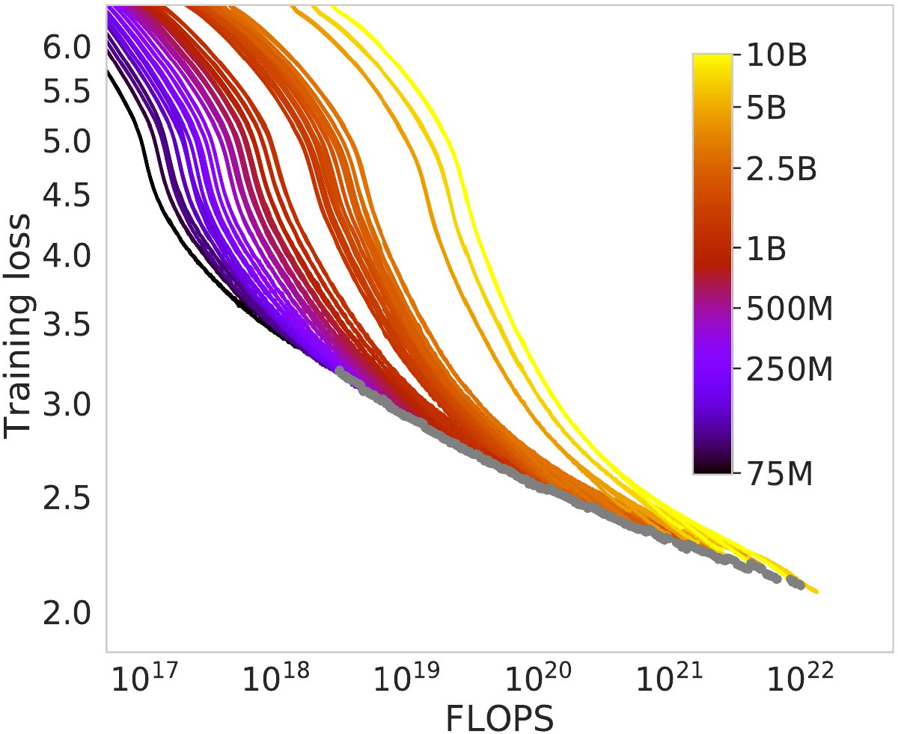
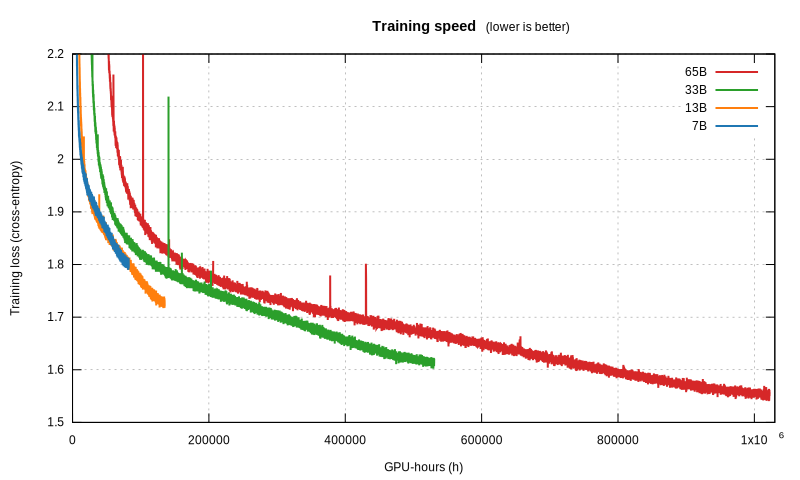
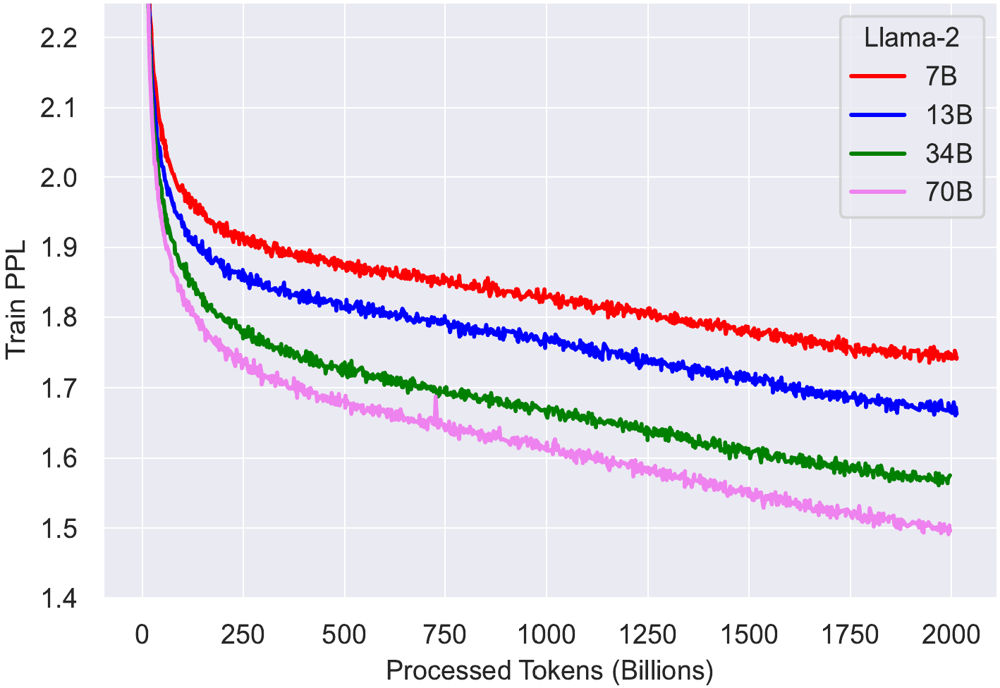
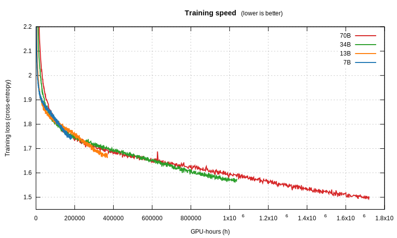
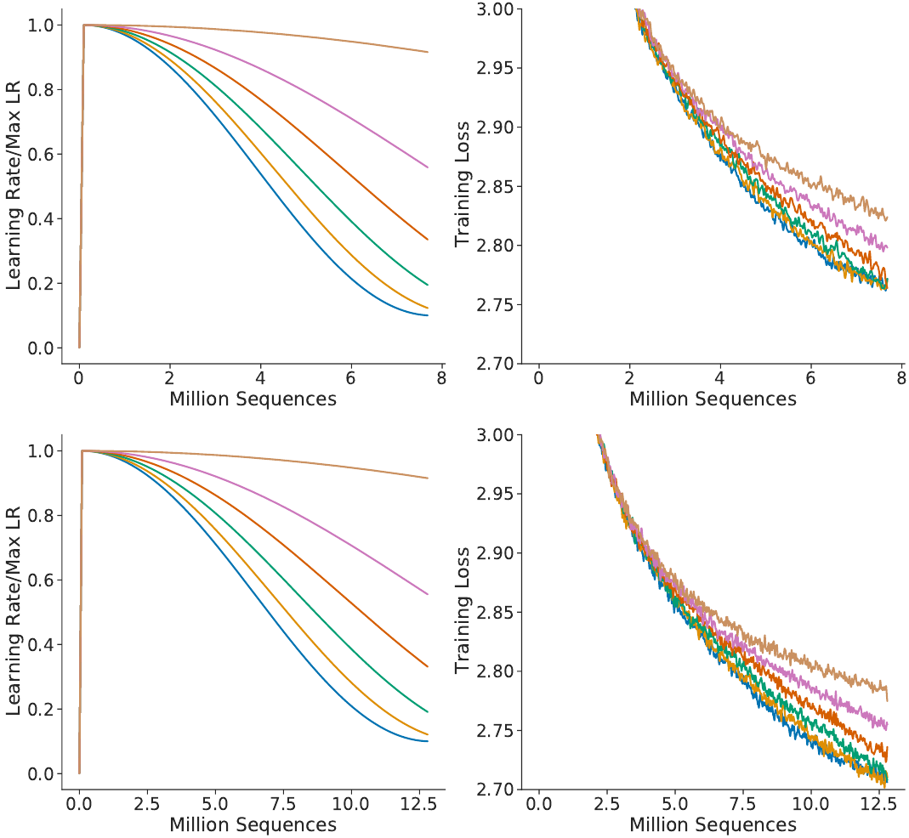

# Chinchilla’s Death

> “With more careful calculations, one can win; with less, one cannot”
> — Sun Tzu, *The Art of War*.

Making extrapolations is crucial to avoid wasting our computing power on slow
convergence. After all, if you had to walk to the Everest,
you wouldn’t eyeball it: you would use a GPS.

Sometimes you have to look away from the GPS and onto the road, though.
Sometimes things don't extrapolate through simple formulae.
It was true for XIXth-century physicists with the [ultraviolet catastrophe][];
it is true for LLMs too.
What we estimate to be true near the center can deviate widely in the far lands…

## What’s this Chinchilla thing anyway?

Smaller models have fewer multiplications.
Thus they run faster. Thus they train faster.
However, the theory goes, they eventually reach the limit of their capacity for
knowledge, and their learning slows, while that of a larger model,
with a larger capacity, will overtake them and reach better performance
past a given amount of training time.

While estimating how to get the best bang for the buck during training,
both [OpenAI][scaling] and [DeepMind][chinchilla] attempted to draw the Pareto
frontier. They don’t state explicitly that they use that theory to draw it;
the closest quote that hints at this hidden assumption is from OpenAI:

> We expect that larger models should always perform better than smaller models.
> […]
> A model with fixed size will be capacity-limited.

This presumption is the bedrock of how they compute the Pareto frontier.
In the Chinchilla work, figure 2 shows the training loss of a large number of
training runs for models with varying size.
At a first glance, those curves follow the theory:
the smaller models initially have a lower loss (good),
but eventually it slows down,
and gets overtaken by the curve from a larger model (bad).

In that chart, they drew grey dots every time they pinpointed the smaller model
starting to lose out to a larger model.
The grey line, the Pareto frontier, is how they computed their scaling laws.

The problem with this assumption is that
we have no idea what would happen if we let the smaller model train for longer,
since they stopped its training as soon as it was overtaken.

Enter the LLaMA paper.

## Can Chinchillas picture a Llama’s sights?

Earlier this year, Meta trained four models with varying sizes.
Unlike other works, they trained each of them for a very large amount of time;
even the smaller ones.

They published the training run curves:

1. Each curve first plummets in a **power law**,
2. and then seemingly enters a **nearly-linear** decrease in loss
   (corresponding to a fairly constant rate of knowledge acquisition).
3. At the very tip of the curve, they all break this line by **flattening**
   slightly.

Right off the bat, I want to tackle a subtle misconception that people can have
related to the end-of-curve flattening.
They are all trained with gradient descent using a variable learning rate
(which is, roughly,
a hyperparameter for how much to go in the direction of the gradient).
To get a good training, they had to constantly decrease the learning rate,
so that it can detect ever-subtler patterns in the source material.
The formula they use for that decrease is the most widely used:
the cosine schedule.

As you can see from the graph, towards the end of the training run,
the cosine schedule stops decreasing the learning rate at the speed which
yielded such a good, near-linear training loss curve.
The slowdown in learning is an artefact of that.
The model does not necessarily cease to have
the capacity to learn at the same near-linear rate!
In fact, if we had more text to give it,
we would have stretched the cosine schedule,
so its learning rate would have continued to go down at the same rate.

The model’s fitness landscape does not depend on the amount of data
we can feed its training; so the change in learning rate decrease
is not well-justified.

That is not the main point of this article, though.

The training loss curve can be misleading in another way.
Sure, they are all trained on the same data;
but they don’t go through that data at the same speed.
What we want to know is **not** how sample-efficient the model is
(on this front, the larger model clearly learns more from what it saw).
Let’s instead picture instead a race:
all those models start at the same time,
and we want to know which one crosses the finish line first.
In other words, when throwing a fixed amount of compute at the training,
who learns the most in that time?

Thankfully, we can combine the loss curves with another piece of data that Meta
provided: the amount of time that each model took to train.

<table>
 <tr><th>   Model   </th><th> GPU-hours </th><th> Tokens/second </th>
 <tr><td> LLaMA1-7B  </td><td>   82432  </td><td>    3384.3    </td>
 <tr><td> LLaMA1-13B </td><td>  135168  </td><td>    2063.9    </td>
 <tr><td> LLaMA1-33B </td><td>  530432  </td><td>     730.5    </td>
 <tr><td> LLaMA1-65B </td><td> 1022362  </td><td>     379.0    </td>
</table>

[*(Code for generating the graph here.)*][code]

Let’s first mention that the whole Chinchilla graph that we saw,
covers only a small sliver on the left of this graph.
In that sliver, we see the same behaviour that Chinchilla documents.
Look at the 7B, for instance (which in the Chinchilla graph would actually be
among the top two curves in terms of size):
it initially drops its loss much faster than the bigger models, then slows down,
and the 13B model overtakes it and reaches 1.9 first.

But then, comes a far-lands, unexpected twist: the 7B enters a near-linear
regime, with a steep downward trend, and seems on its way to maybe overpass the
13B again? It is hard to tell on that graph what would happen if the 7B was
trained for longer.

However, the same behaviour seemed to be true between the 13B and the 33B,
where the initial Chinchilla slowdown also gives way to a near-linear regime,
at which point the 13B goes down fast! It is only surpassed by the 33B unfairly,
by granting the latter more than double the compute time.

And the same slowdown-then-speedup occurs between the 33B and the 65B,
to such an extent that the 33B never actually gets overtaken by the 65B.
What the graph shows breaks OpenAI’s and Chinchilla’s assumption:
**the bigger model hasn’t won** (yet).
The slowdown they detected is not actually caused by reaching some capacity limit!

Still, that 7B line is a bit unsatisfactory.
If only Meta had trained it for longer…

Suspense over: they did! They released LLaMA 2 this week!

## Time to confirm our suspicions

We also, again, got the training times:

<table>
 <tr><th>   Model   </th><th> GPU-hours </th><th> Tokens/second </th>
 <tr><td> LLaMA2-7B  </td><td>  184320  </td><td>    3031.9    </td>
 <tr><td> LLaMA2-13B </td><td>  368640  </td><td>    1515.9    </td>
 <tr><td> LLaMA2-34B </td><td> 1038336  </td><td>     533.7    </td>
 <tr><td> LLaMA2-70B </td><td> 1720320  </td><td>     322.1    </td>
</table>

Immediately, at a glance, we notice that the training curves don’t match those
of LLaMA 1, even when the models are identical.
As it turns out, LLaMA 2 was trained on double the context size,
and a longer cosine schedule, which unfortunately
has negatively impacted all model sizes.
However, smaller models have been impacted worse than larger ones.
As a result, the 34B model, which in LLaMA 1 remained always better than the 65B
model at any training time spent, now dips slightly above the 70B model,
before overtaking it:

More importantly, comparing the training speeds strongly confirms our suspicions
from LLaMA 1:

1. First, they are faster than bigger models,
2. Then, they slow down, and are overtaken by larger models (as per
   Chinchilla),
3. BUT THEN, they enter the near-linear regime, in which smaller models have a
   steeper descent into superior knowledge, and they overtake larger models
   yet again!

A fascinating consequence ties into making the right choices
when starting a training run:
contrary to popular belief, **larger models yield worse results**.
If you had to pick a parameter size and dataset, you might be better off opting
for a 7B model and training for 7 epochs on trillions of tokens.

Look at the near-linear regime of the 7B model, and extrapolate its line to when
the 70B model stopped:
had the 70B computation been spent on the 7B instead,
it would potentially have reached a lower perplexity!

Another thing we notice from LLaMA 2 is that the learning slowdown at the end of
the LLaMA 1 curves was indeed an artefact of the cosine schedule.
That slowdown is completely absent from the LLaMA 2 training run at the
corresponding mark of 1 trillion tokens read.

In fact, maybe the reason that, at that same mark, the LLaMA 2 7B model has a
worse quality than the LLaMA 1 7B model had,
may be because *its cosine schedule is stretched*!

Let’s go back to the Chinchilla paper to argue that point.
In appendix A, figure A1, they show an ablation study for various cosine
schedule parameters (phrased another way:
various ways to stretch the learning rate curve).

They make the point that the lowest loss is achieved when the curve is not
stretched. That is supported by the graphs, but we notice something off.
After reading 6 million tokens, the training loss at the top is below 2.8;
meanwhile, at the same mark, the training loss of the bottom model is above.
Yet the only difference between the models is the cosine schedule!
Because the bottom model was slated to go through more training data,
the “unstretched” cosine schedule was computed for a bigger number of steps,
which effectively stretches it.
If the learning rate had instead followed
the schedule assigned to fewer training steps,
it would have had a better loss for the same amount of training time.

More broadly, that raises a question that I leave open:
if the cosine schedule is not optimal,
how should the shape of its tail be instead?

[ultraviolet catastrophe]: https://en.wikipedia.org/wiki/Ultraviolet_catastrophe
[scaling]: https://arxiv.org/abs/2001.08361
[chinchilla]: https://arxiv.org/abs/2203.15556
[llama1]: https://arxiv.org/abs/2302.13971
[llama2]: https://arxiv.org/abs/2307.09288
[cosine]: https://arxiv.org/pdf/1608.03983.pdf
[code]: https://github.com/espadrine/espadrine.github.com/blob/master/blog/assets/chinchilla-s-death/llama-data.py

