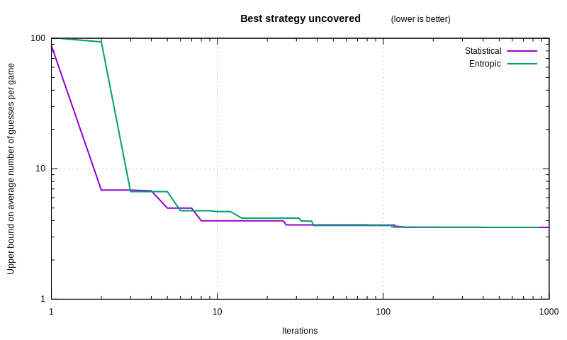

# Faster Wordle Estimators

Two years ago, the game of [Wordle][] was released.
I wrote [an article back then on finding good words to solve it][art1],
but I focused on implementing a good-enough algorithm,
which was a bit slow, and switched programming language
trying to tame its speed. I ended it saying: “Algorithms do matter too.”

It would be nice if, instead of language-specific tweaks,
we found an algorithm that made the runtime plummet
from half an hour to a second.

It would be nicer if we created an algorithm that achieved perfect play.

It would be even neater if that algorithm was so generic,
that it could solve a whole class of similar games.

## From formula to approximation

### Statistical

The strategy we left off in the previous article had merit:
it computed the average number of possible solutions left over
after making a particular guess.
Given the set of solutions $`\mathscr{S}`, we compute for each guess $`g`:

```latex
\mathscr{R}(g) \stackrel{\text{def}}{=} \frac{ \sum_{s \in \mathscr{S}} |\{s'|s' \in \mathscr{S}, \mathscr{C}(s'|g)=\mathscr{C}(s|g)\}| }{|\mathscr{S}|}
```

where $`\mathscr{C}(s|g)` is the constraint that Wordle unveils
if the secret solution is $`s` and the guessed word is $`g`.
For instance, if the secret word is “craft”,
and we input the guess “salet”, Wordle will yield
the constraint ⬛🟨⬛⬛🟩 (second letter misplaced,
last letter correct, other letters absent from the secret word).

We can rephrase the formula using the Iverson bracket
(which is 1 if the condition is true, 0 otherwise):

```latex
\mathscr{R}(g) = \frac{ \sum_{s \in \mathscr{S}} \sum_{s' \in \mathscr{S}} ⟦\mathscr{C}(s'|g)=\mathscr{C}(s|g)⟧ }{|\mathscr{S}|}
```

Let’s now do a magic trick.
We can insert a sum over constraints
(defining $`\mathscr{C}` as the set of constraints)
if that sum only contains a single term.
It is the case below,
since a guess always produces the same constraint for a given solution:

```latex
\mathscr{R}(g) = \frac{ \sum_{s \in \mathscr{S}} \sum_{c \in \mathscr{C}} ⟦\mathscr{C}(s|g)=c⟧ \sum_{s' \in \mathscr{S}} ⟦\mathscr{C}(s'|g)=\mathscr{C}(s|g)⟧ }{|\mathscr{S}|}
```

We can now swap the summations:

```latex
\mathscr{R}(g) = \frac{ \sum_{c \in \mathscr{C}} \sum_{s \in \mathscr{S}} ⟦\mathscr{C}(s|g)=c⟧ \sum_{s' \in \mathscr{S}} ⟦\mathscr{C}(s'|g)=c⟧ }{|\mathscr{S}|}
```

Finally, we notice that the innermost sum is independent of $`s`,
so we can factorize it:

```latex
\mathscr{R}(g) = \frac{ \sum_{c \in \mathscr{C}} \left(\sum_{s \in \mathscr{S}} ⟦\mathscr{C}(s|g)=c⟧\right)^2 }{|\mathscr{S}|}
```

That is much faster to compute:
there are only $`|\mathscr{C}| = 3^5=243` possible constraints,
but there are $`|\mathscr{S}| = 3158` word solutions.
What used to take $`|\mathscr{S}|^2` operations
now takes $`|\mathscr{S}| + |\mathscr{C}|`.
The computation that used to take hours in the previous article,
now takes a mere second:

```julia
# Compute the average remaining solutions for each guess.
function average_remaining_solutions_after_guess(guess::Vector{UInt8}, solutions::Vector{Vector{UInt8}})::Float64
  counts = zeros(Int, 243)
  for solution in solutions
    @inbounds counts[constraints(guess, solution) + 1] += 1
  end
  return sum(abs2, counts) / length(solutions)
end
```

Hat tip to Douglas Bates from the Julia community
for [figuring that out!][DMBates]

From there, building an estimation of the number of remaining guesses $`n`
is smooth sailing. We can assume that we maintain
a constant ratio $`\rho` of removed solutions after each guess.
We have $`|\mathscr{S}|` solutions currently, and at the end we have only 1.
So before the last guess, we had $`\rho` solutions,
and before the guess before that, we had $`\rho^2`…
All the way back to now, where we have $`\rho^{n-1} = |\mathscr{S}|`.
Hence $`n = 1 + \frac{\log|\mathscr{S}|}{\log(\rho)}`.

```julia
# Including this guess, how many guesses remain until we win?
function estimate_guesses_remaining_statistically(guess::Vector{UInt8}, solutions::Vector{Vector{UInt8}})::Float64
  avg_remaining = average_remaining_solutions_after_guess(guess, solutions)
  nsols = length(solutions)
  # Probability that the guess wins directly,
  # avoiding having to do another guess.
  prob_sol = if guess in solutions
    1 / nsols  # If this pick is a winner, there are no more guesses to make.
  else
    0
  end
  expected_guesses = 1 + log(nsols) / log(nsols / avg_remaining)
  return prob_sol * 1 + (1-prob_sol) * expected_guesses
end
```

### Entropic

Of course, there are multiple ways to estimate the number of remaining guesses.
Information theory provides a framework for analysing
just how much information we gain from the constraint that Wordle reveals.
In information theory, we deal with symbols
and study the probability that they appear.

In our case, we have one symbol for each constraint.
The probability that a constraint appears is
$`p(c) = \frac{|\{s|s \in \mathscr{S}, \mathscr{C}(s|g)=c\}|}{|\mathscr{S}|}`.
The amount of information gained, in bits, by seeing a constraint
is the entropy of Wordle:

```latex
\mathscr{H} \stackrel{\text{def}}{=} -\sum_{c \in \mathscr{C}} p(c) \log_2 p(c)
```

At the end, once there are zero bits of information,
we know the solution for sure,
but we still have to submit it as a guess in order to win.
Before that, we were 2 guesses away from a win,
and assuming we gain as many bits of information on each guess,
we had $`\mathscr{H}` bits of information.
Before that, we were 3 guesses away from the end,
and had $`2 \mathscr{H}` bits of information, and so forth.
At the start, the amount of information we had was
$`\mathscr{I} \stackrel{\text{def}}{=} \log_2|\mathscr{S}| = (n-1) \times \mathscr{H}`.
Hence we obtain:

```latex
n = \frac{-\log_2|\mathscr{S}|}{\sum_{c \in \mathscr{C}} p(c) \log_2 p(c)} + 1
```

This approach is [inspired by Grant Sanderson][Entropic],
and has the redeeming quality of being efficient to compute
even without casting mathematical spells on the formula:

```julia
# Including this guess, how many guesses remain until we win?
function estimate_guesses_remaining_entropically(guess::Vector{UInt8}, solutions::Vector{Vector{UInt8}})::Float64
  counts = zeros(Int, 243)  # Number of times the constraint appears across solutions.
  for solution in solutions
    @inbounds counts[constraints(guess, solution) + 1] += 1
  end
  nsols = length(solutions)

  entropy = 0.0
  for count in counts
    if count == 0
      continue
    end
    # Probability of a constraint appearing after we make this guess.
    prob = count / nsols
    entropy -= prob * log2(prob)
  end
  expected_guesses = log2(nsols) / entropy + 1

  # Probability that the guess wins directly,
  # avoiding having to do another guess.
  prob_sol = if guess in solutions
    1 / nsols
  else
    0
  end

  return prob_sol * 1 + (1-prob_sol) * expected_guesses
end
```

Are those estimations good, though?

## Weighing the souls of our formulae

Estimators always offer a tradeoff.
What matters at the end is not how good it is on its own,
but how well it melds within the overall struture.

### Heuristic

The first thought you might have on how to use the estimator,
is to pick its best suggested guess at each step of the game.
Here is what we would get:

<table>
  <tr><th> Estimator </th><th> Expected number of guesses to win </th></tr>
  <tr><td> Statistical </td><td> 3.6450 </td></tr>
  <tr><td> Entropic </td><td> 3.5687 </td></tr>
</table>

That is better than the [human average of about 4][Human]!

It also seems to prefer entropic calculations.
That could be due to chance, however.

(By the way, beware of comparing any of the figures I give to other articles.
Bot performances depend on the word lists,
which the *New York Times* has changed multiple times,
making the game slightly harder.
Meanwhile, human statistics often have selection bias,
considering that people that fail to solve in 6 guesses
cannot give the true number of guesses they would require,
on top of the obvious bias that people only publish good results.)

### Accuracy

Heuristics give a good-enough strategy.
We want to go further than “good enough” though.
We target optimal play.

With that in mind, the true intent of the estimator
is to predict the performance of perfect play.
Let’s compare the estimation to
[the true optimal figure][Selby].

<table>
  <tr><th> Estimator </th><th> Mean squared error </th></tr>
  <tr><td> Statistical </td><td> 0.9932 </td></tr>
  <tr><td> Entropic </td><td> 0.1044 </td></tr>
</table>

The entropic estimation wins again; that said, surprisingly,
if we restrict the analysis to the best 100 guesses,
which are most likely to be useful,
we get a reversed picture, which may matter later:

<table>
  <tr><th> Estimator </th><th> Mean squared error </th></tr>
  <tr><td> Statistical </td><td> 0.0266 </td></tr>
  <tr><td> Entropic </td><td> 0.2533 </td></tr>
</table>

### Convergence

Here’s a sneak peek at how each estimator fares
within a self-optimizing algorithm.

That algorithm iterates until it finds the optimal choices
throughout the whole game, for all possible solutions.
What we plot is the optimizer’s best-known playing strategy.
It is conservative, not an estimation:
it starts out on iteration zero (not depicted) at 3158 guesses
(brute-forcing through all possible words).
Whenever it has yet to explore a guess, it assumes brute-force,
thus offering an upper bound on the optimal strategy
which eventually converges to it.

We want that algorithm to converge to the optimal strategy fast,
and the number of iterations is a good proxy
for how long it takes to achieve a certain level.



The statistical estimator starts out with an advantage,
likely because it is more accurate for better guesses.
But that makes it overconfident on its accuracy;
meanwhile the entropic estimator’s evaluated uncertainty
encourages it to search through a wider array of options,
and it eventually overtakes the statistical one permanently,
finding the optimal strategy first.

## Coincidental circumstances

Was it obvious from the get-go that the entropic estimator would end up on top?
It feels to me like there is a bit of luck involved:

- Its formula gives way to a fast algorithm without mathematical tour-de-force;
- Its higher accuracy overall ends up being beneficial,
  despite being less accurate on the guesses that matter,
  likely because it predicts pairwise rankings better;
- By sheer luck, on the current wordlist, its top guess is the optimal guess.

In the next article, let’s dig further into the weeds
of building a fully game-agnostic self-optimizing algorithm
that finds the best strategy fast,
using the entropic estimator as a foundation.

[Wordle]: https://www.nytimes.com/games/wordle/index.html
[art1]: https://espadrine.github.io/blog/posts/sometimes-rewriting-in-another-language-works.html
[DMBates]: https://discourse.julialang.org/t/rust-julia-comparison-post/75403/55
[entropic]: https://www.youtube.com/watch?v=v68zYyaEmEA
[Human]: https://www.nytimes.com/2023/03/08/crosswords/refreshing-gameplay.html
[Selby]: https://sonorouschocolate.com/notes/index.php/The_best_strategies_for_Wordle,_part_3_(July_2023)

<script type="application/ld+json">
{ "@context": "http://schema.org",
  "@type": "BlogPosting",
  "datePublished": "2024-02-17T10:24:32Z",
  "keywords": "ml, julia, optimization" }
</script>
