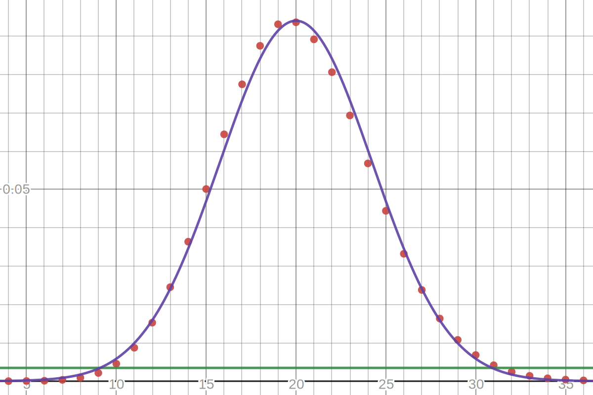
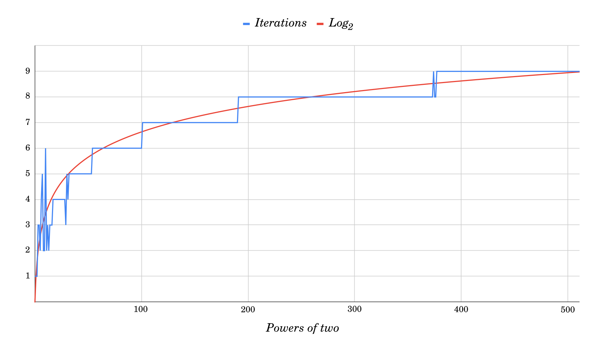

# Mean Range of Bell Curve Distributions

**Abstract:**
When sampling several data points from a known statistical distribution,
a valuable indication of the spread is the range of the set of values obtained.
Since the sampling is probabilistic,
the best estimate we can hope for is the expected value of the range.
That mean range,
along with the expected maximum and minimum values of the sampling set,
are traditionally difficult to compute with existing means.
We present a method to perform that computation,
and its implications on the correct computation of the balls-into-bins problem.

<style>
.ballsIntoBins {
  width: 90%;
  margin: auto;
  padding: .6em 2em;
  border: 1px solid lightgray;
  border-radius: 50px;
  background-color: #fafaff;
}
.ballsIntoBins p {
  text-align: center;
}
.ballsIntoBins input {
  width: 7ex;
}
output { word-break: break-all; }
</style>
<div class=ballsIntoBins>
  <p> Randomly placing this number of balls:
    <input id=ballsInput value='2^128'>
    = <output id=ballsOutput>340282366920938463463374607431768211456</output>,
  <br> in this number of bins:
    <input id=binsInput value='2^128'>
    = <output id=binsOutput>340282366920938463463374607431768211456</output>,
  <br> causes the least filled bin to contain
    <output id=minOutput>0</output>
    balls, whilst the most filled bin contains
    <output id=maxOutput>33</output>
    balls, which is
    <output id=rangeOutput>33</output>
    more.
  <p id=ballsErrors>
</div>

## 1. Generic Derivation

Consider a distribution with probability density function $`\varphi`.
Its associated random variable, $`X`, can be either real-valued or discrete.

We observe a sample of $`N` independent values taken from that distribution.

The question we ask is:
What is the range of values that have a probability ≥ $`\gamma`
(across samplings of $`N` values) of appearing in the sample?
For instance, for a mean range, one would pick $`\gamma = \frac{1}{2}`.

Despite being potentially continuous, we can research the probability
that a given value appears at least once in the sample.
That is $`1 - P_{excluded}`, where $`P_{excluded}` is the probability
that the value does not appear in the sample.

In turn, given that the sample is independently drawn each time,
the probability that a value is not drawn once,
is $`P_{excluded} = (1 - \varphi(x))^N`.

Thus, the probability that a given value is in the sample,
is $`1 - (1 - \varphi(x))^N`.
By definition, that probability is equal to $`\gamma`.

We can therefore derive that the values $`x` that are in range,
follow the equation:

```latex
\varphi(x) \geq 1 - \sqrt[N]{1 - \gamma}
```

When $`\varphi` is a bell curve distribution,
the corresponding equality has two solutions for $`x`.

## 2. Application to the Normal

Some bell distributions are more easily invertible.
Thankfully, *this is true of the Normal distribution*,
which will enable us to produce good estimations for all distributions,
thanks to the **central limit theorem**.

First, let us derive the exact Normal solution.
We have $`\varphi(x) : \mathcal{N}(\mu, \sigma^2)`:

```latex
\varphi(x) = \frac{e^{-\frac{(x-\mu)^2}{2\sigma^2}}}{\sqrt{2\sigma^2\pi}}
```

Thus the solution to the general inequality is:

```latex
x \in \left[
  \mu \pm \sqrt{-2\sigma^2
    \ln(\sqrt{2\sigma^2\pi}(1-\sqrt[N]{1-\gamma}))}
\right]
```

From this, we can compute the maximum and minimum exactly,
along with the mean range, which follows this formula:

```latex
2\sqrt{-2\sigma^2 \ln(\sqrt{2\sigma^2\pi}(1-\sqrt[N]{1-\gamma}))}
```

## 3. Application to the Binomial

The PDF of a binomial distribution $`\beta(x) : \mathcal{B}(m, p)`,
the probability of a number $`x` of positive events
among $`m` events with probability $`p` of positivity,
follows this equation:

```latex
\beta(x) = {m \choose x} p^x (1-p)^{m-x}
```

While $`x` is a discrete integer,
the distribution of $`\mathcal{B}(m, p)` is also is bell-shaped.
Thus the generic derivation above can also be applied.

Two issues arise when using that derivation, however:

- Unlike the Normal, the binomial coefficient cannot be elegantly **inverted**,
  which prevents us from producing an exact formula.
- For large values of $`m - x` (around $`2^{128}`),
  calculating that binomial coefficient exactly
  is **too computationally expensive** to yield a result within a lifetime.

We can however devise an algorithmic method
by which we obtain an exact answer regardless.

The first issue can be solved by computing $`\beta(x)` for all values of $`x`
until the bell curve plummets back below $`\tau = 1-\sqrt[N]{1-\gamma}`.
However, that method is impractical when $`x_{max}` is too large.

Instead of going through each value of $`x`,
our algorithm can search for the right value
through increasingly accurate approximations,
similar to the way Newton’s method works.

This convergence works by:

1. Using the best model we have of the distribution,
2. Gathering information from the estimated root,
3. Updating the model to be even more precise,
4. Iterating, similar to an interpolation search,
   until eventually, we find two consecutive integers
   $`x_{max}` and $`x_{max}+1` where the first is above the limit
   (obtained from the generic derivation),
   and the other is not.

The two challenges in implementing this algorithm are:

- Problem 1: Evaluating $`\beta(x)` is too expensive for large $`x`
  using integer arithmetic operations,
- Problem 2: Establishing a good and computable model for the distribution,
  and updating it in such a way that ensures eventual and fast convergence.

### 3.1. Evaluating the PDF

We use the classic solution:
first, convert the binomial coefficient formula to use the Gamma function.

```latex
\beta(x) = \frac{\Gamma(m+1)}{\Gamma(x+1)\Gamma(m-x+1)} p^x (1-p)^{m-x}
```

Then, to avoid handling large gamma results,
we rely on an exact computation of the log-gamma.
We can use an arbitrary-precision library
to ensure we get an error below the integer result we end up with.
(To find the right precision to set for the algorithm,
we can rely on exponential binary search.)

```latex
\beta(x) = e^{
  \ln\Gamma(m+1) - \ln\Gamma(x+1) - \ln\Gamma(m-x+1)
  + x \ln(p) + (m-x) \ln(1-p)
}
```

### 3.2. Converging to the range extrema

Given the shape of the PDF, and its reflectional symmetry,
we can *bound* the expected maximum sample to be between the mean
and the end of the curve.

```latex
mp \leq x_{max} \leq m
```

We set those bounds as $`x_{low}` and $`x_{high}`,
and estimate the value of $`x_{max}` from its Gaussian approximation:

```latex
\hat{x}_{max} = \left\lceil
  mp + \sqrt{-2mp(1-p)
    \ln(\sqrt{2mp(1-p)\pi}(1-\sqrt[N]{1-\gamma}))}
  \right\rceil
```

We can then compute the accurate value of $`\beta(\hat{x}_{max})`.
If that value is below $`\tau`, we are too far:
we set the upper bound $`x_{high}` to our $`\hat{x}_{max}` estimate.
Otherwise, we set $`x_{low}` to it instead.

<figure>
  
  <figcaption><p>Plot of 𝔅(200, 10<sup>-1</sup>) in red,
    and its approximating Gaussian in blue.
    τ is shown in green.
    Note how the Normal approximation is off by one on the minimum,
    but the shape of its curve is a good fit locally,
    apart from being horizontally off.
  </figcaption>
</figure>

Then, we must **improve our estimated model**.

*Newton’s method* is insufficient,
because it does not guarantee convergence,
and because its convergence is comparatively slow
as a result of the flatness of the curve.

*Binary search*, taking the average of $`x_{low}` and $`x_{high}`,
produces a reliable convergence in $`O(\log(m))`,
but it does not use our existing knowledge of the shape of the curve.

The normal curve is quite a good approximation,
especially with large values.
(With small values, the convergence is fast anyway.)

However, past the first estimation,
the normal curve is too far from where the binomial curve intersects $`\tau`.
Thus we must slide it, either to the left or to the right,
so that it coincides laterally
with the real point $`\{\hat{x}_{max}, \beta(\hat{x}_{max})\}`
whose abscissa is an estimate of $`x_{max}`.

That new curve is another Gaussian distribution,
with a mean that solves the equation
$`\varphi_{\mu, \sigma^2}(\hat{x}_{max}) = \beta(\hat{x}_{max})`:

```latex
\mu = \hat{x}_{max} - \sqrt{-2\sigma^2\ln(
    \beta(\hat{x}_{max})
    \sqrt{2\sigma^2\pi}
  )}
```

However, there is no guarantee that it will intersect $`\tau`
between $`x_{low}` and $`x_{high}`.
As a fallback, if it is out of bounds, we ignore the normal estimate
and use the average of $`x_{low}` and $`x_{high}`,
just like binary search.

Once the bounds $`x_{low}` and $`x_{high}`
have converged into adjacent integers,
we have found $`x_{max} = x_{low}`.

As for $`x_{min}`, the process is symmetrically identical,
except it occurs within the bounds:

```latex
0 \leq x_{min} \leq mp
```

and using the following, reminiscent mean update:

```latex
\mu = \hat{x}_{min} + \sqrt{-2\sigma^2\ln(
    \beta(\hat{x}_{min})
    \sqrt{2\sigma^2\pi}
  )}
```

The algorithmic complexity of the convergence is in $`O(log(m))` worst-case,
degrading to binary search, but is empirically $`O(log(log(m)))` on average:


<figure>
  
  <figcaption>
    <p>Plot of the number of iterations necessary to reach convergence,
    when computing the maximum of a sample of 2<sup>i</sup> elements
    from a Binomial 𝔅(2<sup>i</sup>, 2<sup>-2i</sup>) distribution, in blue.
    In red is log<sub>2</sub>(i),
    which matches the shape of convergence speed asymptotically.
    <p>Not shown is the number of iterations for binary search.
    It would be a straight diagonal: 2<sup>i</sup> takes i iterations.
  </figcaption>
</figure>

## 4. Balls Into Bins

This result allows exact computation of solutions for a well-known problem:
*“Given $`N` balls each randomly placed into $`R` bins,
how many do the most and least filled bin have?”*

The problem is a sampling of $`N` values
of the Binomial distribution $`\mathcal{B}(N, \frac{1}{R})`.
Thus, the mean maximum and minimum are its solutions.

The widget at the top of the page gives an instant and exact result
for this problem, for values below $`2^{1024}`.

### 4.1. Hash tables

One use for this problem is in assessing the worst-case complexity
of **hash table** operations to match operational requirements.
Indeed, the hash output is meant to be uniformly distributed;
in other words, a [PRF][]: one such example is [SipHash][].

Since the implementation of hash collisions typically require linear probing,
library developers strive for a bounded maximum number of hashes
that map to the same table entry. Typically, they use a [load factor][]:
if more than 87.5% of the table is filled,
the table size is doubled and rehashed.

The widget above can help show that
this approach does not yield a bounded maximum,
by inputting `0.875*2^i` balls into `2^i` bins:

<table>
  <tr><th> Table size    <th> Max bucket size
  <tr><td> 2<sup>8</sup> <td> 4
  <tr><td> 2<sup>16</sup><td> 7
  <tr><td> 2<sup>32</sup><td> 11
  <tr><td> 2<sup>64</sup><td> 19
</table>

As you can see, the growth is very slow,
which satisfies engineering constraints.
If there was some imperative to be bounded below a certain value,
the table algorithm could use the principles laid out in this article
to dynamically compute the load factor
that keeps the maximum bucket size below the imposed limit.

(A notable exception to this result is [Cuckoo Hashing][],
whose maximum bucket size has a different formula.)

### 4.2. Hash chains

Another situation where this problem finds relevance is in **cryptography**.
First, in the field of collision-resistant functions.
In a [Merkle chain][], the root hash has a single hash as input.
The 256-bit input of the SHA-256 primitive randomly maps to its 256-bit output.
There will be one particular hash output that 57 distinct inputs produce.
The pigeonhole principle dictates that this removes possible outputs;
and indeed, about 38% of the $`2^{256}` possible output hashes
cannot be produced.
In other words, if you take a random 256-bit hex string,
it will not be a valid output in one case out of three.

Indeed, the probability that a bin has no balls
after the first link in the chain is
$`\beta_{n = 2^{b},\,p = 2^{-b}}(0)
= (1 - 2^{-b})^{2^{b}}
\xrightarrow{\, b \rightarrow \infty \,} \frac{1}{e}`
for a $`b`-bit hash.
On the $`i`-th chain of the link, the same phenomenon strikes again,
and only $`h_i = 1 - (1 - 2^{-b})^{2^{b}h_{i-1}}` remain
(with $`h_0 = 1` since we start with 100%).

Of course, after that initial 38% loss, the subsequent losses are lesser,
but $`h_i \xrightarrow{\, i \rightarrow \infty \,} 0`.
After just 100 iterations, only 2% of possible hashes remain.
After the typical 10k iterations of [PBKDF2][], only 0.02% remain.

It is not a vulnerability per se
(it only removes about 13 bits off a 256-bit space,
or 7 bits of security against collision resistance),
but it is a showcase of how simple designs can have subtle consequences.

### 4.3. Block ciphers

Consider a 128-bit block cipher (PRP), such as [AES-128][AES].
Let’s say that a single 16-byte block of plaintext was encrypted
with a fully random 128-bit key.
An attacker examines the 16-byte ciphertext block.

While it is true that for a given key,
each plaintext block produces a single ciphertext block and vice-versa,
for a given ciphertext block, each key maps to a random plaintext block.
Keys can be seen as balls, and plaintext blocks as bins.

Conversely, about $`\frac{100}{e}\%` of plaintext blocks
have zero keys that decrypt the ciphertext to them.
Thus, if the plaintext block contained a single bit of information,
such as a presidential vote in a majoritarian election,
*and if finding the number of valid keys was computationally feasible*,
the adversary could decrypt the vote with probability $`\frac{1}{e}`.

Yet again, it is not a vulnerability,
since the only currently-known way to do so is to brute-force the key,
but it creates an unintuitive attack that a larger key would dismiss.

Similarly, in a chosen-ciphertext attack (CPA)
against a 128-bit block cipher with a 256-bit key such as [AES-256][AES],
the set of possible couples of plaintext/ciphertext blocks
is $`2^{128+128} = 2^{256}`, while the set of keys is $`2^{256}`.
Since the former randomly map to the latter,
about a third of all keys would be disqualified with a single queried pair,
and a third of the remaining keys with a second query, and so forth.
About 387 queries would yield a single possible key.
However, actually extracting and combining that information
efficiently and without loss is an open problem related to SAT.

Finally, still in [AES-256][AES], for a given ciphertext block,
the plaintext block with the most keys decrypting to it
has about 600 quintillion more keys
than the plaintext block with the least keys, making it more likely.
That may superficially seem like a disadvantage
of using larger keys than the block size.
However, the advantage gained compared to the least likely plaintext block
is only an increased probability by $`2^{-187}`,
which is not only extremely negligible, but also smaller than in AES-128.

## Conclusion

We described an exact formula for the mean range
and extrema of a Normal distribution.
We used it to produce an algorithm
that can compute the extrema of any bell curve distribution,
with the example of the Binomial distribution.
We optimized that algorithm to run in $`O(log(log(m)))` average time,
and discussed a few exact consequences that used to be unconfirmed approximations.

[PRF]: https://eprint.iacr.org/2017/652.pdf
[SipHash]: https://www.aumasson.jp/siphash/
[load factor]: https://github.com/rust-lang/hashbrown/blob/805b5e28ac7b12ad901aceba5ee641de50c0a3d1/src/raw/mod.rs#L206-L210
[Cuckoo Hashing]: http://www.cs.toronto.edu/~noahfleming/CuckooHashing.pdf
[Merkle chain]: https://patents.google.com/patent/US4309569
[PBKDF2]: https://nvlpubs.nist.gov/nistpubs/Legacy/SP/nistspecialpublication800-132.pdf
[AES]: https://nvlpubs.nist.gov/nistpubs/FIPS/NIST.FIPS.197.pdf

<script async src="../assets/mean-range-of-a-bell-curve-distribution/mp-wasm.js"></script>
<script async src="../assets/mean-range-of-a-bell-curve-distribution/normal-mean-range.js"></script>
<script async src="../assets/mean-range-of-a-bell-curve-distribution/binomial-mean-range.js"></script>
<script async type=module src="../assets/mean-range-of-a-bell-curve-distribution/cli-calculator.js"></script>
<script defer type=module>
import Calculator from '../assets/mean-range-of-a-bell-curve-distribution/cli-calculator.js';

function initBallsIntoBins(mpWasm) {
  const calc = new Calculator(mpWasm);
  calc.mpf.setDefaultPrec(1024);
  const updateBallsIntoBins = function() {
    ballsErrors.textContent = '';
    const balls = calc.compute(ballsInput.value);
    if (balls.errors.length > 0) {
      ballsErrors.innerHTML = balls.errors.map(e => e.toString()).join('<br>');
      return;
    }
    const nballs = balls.result[0];
    ballsOutput.value = nballs.round().toString();

    const bins = calc.compute(binsInput.value);
    if (bins.errors.length > 0) {
      ballsErrors.innerHTML = bins.errors.map(e => e.toString()).join('<br>');
      return;
    }
    const nbins = bins.result[0];
    binsOutput.value = nbins.round().toString();

    const range = binomialRange(nballs, calc.mpf(1).div(nbins), nballs);
    minOutput.value = range.min.toString();
    maxOutput.value = range.max.toString();
    rangeOutput.value = range.range.toString();
  };
  ballsInput.addEventListener('input', updateBallsIntoBins);
  binsInput.addEventListener('input', updateBallsIntoBins);
}

addEventListener('DOMContentLoaded', () => {
  fetchMPWasm('../assets/mean-range-of-a-bell-curve-distribution/mp.wasm')
  .then(mpWasm => {
    const mpf = window.mpf = mpWasm.mpf;
    initBallsIntoBins(mpWasm);
  });
});
</script>


<script type="application/ld+json">
{ "@context": "http://schema.org",
  "@type": "BlogPosting",
  "datePublished": "2021-01-13T19:21:50Z",
  "keywords": "stats, crypto" }
</script>
