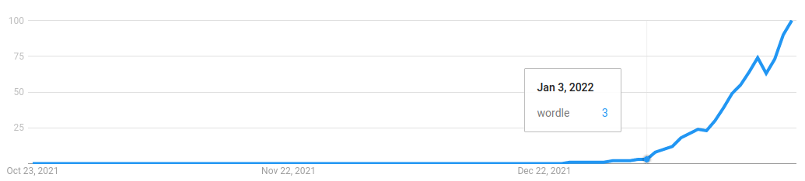

# Sometimes, rewriting in another language works

 <section id="logParagraph"></section>
 <form action="javascript:void 0">
  
<label> Guess: <input id="guessInput" placeholder="salet"></label>
   <label> Constraint: <input id="constraintInput" placeholder="ox..."></label>
  

  

   <button id="guessButton">Guess</button>
   <button id="restartButton">Restart</button>
    Computing…
  

 </form>
 
 The constraint should be 5 characters: 
  o = letter at right spot, x = wrong spot, . = not in the word.

 

This month, the game of [Wordle][] has exploded in popularity.

The principle is simple: every day, a secret 5-letter word must be guessed
by everyone on the planet from the comfort of their confinement.
We each have 6 guesses: every time we make one,
the website lists all **correctly positioned letters**,
all **incorrectly positioned ones**,
and the letters that are **not in the solution**.

## Strategy

Playing the game, there are many strategies you quickly pick up.

1. English letter frequencies help choose guesses that divide the search space faster.
2. You can make guesses that don’t follow previously reveiled constraints:
   a completely different guess can narrow down the possibilities much more.
3. Using common vowels on the first guess and common consonants on the second,
   helps narrow down possibilities very fast.

Many [bloggers][blog1] have [tried][blog2] their [hand][blog3] at
[optimal][blog4] strategies.
While skimming through them, it felt like each approach had issues.
That motivated me to add to the pile of suboptimal techniques with my own,
hopefully less flawed, algorithm.

## Principles

I like to start tackling optimality problems by *betting on brute force*.
It sometimes works right off the bat,
and when it does not, I learn a lot from it on what to improve.

Many players focus on letter frequency, but while it can feel like brute force,
it does not brute-force the right solution.
Indeed, the guess with the most likely letters does not segment the search
space fairly. A lot of words have the most likely letters, after all.

One (admittedly suboptimal, but superior) target,
is to take the list of possible solutions, and find the guess which, on average,
reduces the search space the most, by eliminating the most candidate words.

This is where we get our hands dirty with the nitty-gritty details.

There are two different lists in the JS code of the game’s webpage.

1. One contains the **2315** potential solutions,
2. and the other contains **10657** other words that will never be solutions,
   but that can still be used as guesses. Red herrings, if you will.

You may think the red herrings are useless, but in fact,
they can achieve a greater elimination rate.

So, the algorithm needs to loop over all guesses.

For each one, it must compute the number of eliminated solutions,
for each possible solution.

To do that, it must loop over all possible solutions,
compute the constraint information that Wordle would produce for that guess,
and then loop over all possible solutions again
to count how many those would reject.

There are five letters in each guess, producing five constraints to check,
and some constraints require looping over all letters of the solution.

Overall, the number of operations is (10657+2315) × 2315 × 2315 × 5 × 5.
That is 1,737,996,667,500 steps.

That number is in that weird range of brute-force expectations:
*it is not unreachable, but it is not trivial either*.
Converting to nanoseconds, it is about half an hour;
but we can just feel our gut feeling yelling
that each operation will take a bit more than a nanosecond.

## Optimism is healthy, right?

Off I went, candidly [implementing the algorithm][jlimpl] in [Julia][Julia].

(I like Julia for its type system and extensive standard library,
which makes it my go-to desk calculator.
It also [cares about performance][jlperf],
relying on an LLVM-based JIT compiler.)

Since I knew I was in for a long compute time,
I added a fancy duration estimator based on the average time the top loop took.

Sadly, this is what I saw:

    $ julia play-optimally.jl
    Ranking guesses... 1/12972 words (24950 min left)

Hang on, that is not half an hour… It is closer to 17 days!

At that point, I really had three options:

1. Optimizing,
2. Parallelizing,
3. Rewriting in a faster language.

## Pessimism is healthy, too

I felt I could rewrite it in Rust within two hours.
My mental model of how the compiled assembly should be,
made me believe that Julia’s compiler was doing something wrong,
and that Rust would indeed be much faster.

However, I had no certainty, and a common maxim states that rewriting is usually
less fruitful than redesigning with better algorithms.

Parallelizing was another option, but I did not jump with joy at the idea of
bringing my laptop to its knees by squeezing each of my 8 threads for…
let me calculate… upwards of 50 continuous hours, at best?!

So I made a compromise:
*I would spend 2 hours trying to fight the Julia compiler and figure out how to
get it going fast*.

But the volume of possible compiler bailouts is large,
and the sweet spot of JIT performance is a needle in a haystack.

Reader, you know where the story is going:
those two hours were fruitless,
and the next two successfully [rewrote it all in Rust][rsimpl].

    $ time cargo run
    Ranking guesses... 11/12972 words (441 min left)

And just like that, I was granted the best Wordle guess in 7h,
15% of the time that parallelizing Julia would have given me.

## A warning on what the moral is

Sure, the main conclusion is this:

> Sometimes, rewriting in a more suitable language will get you the answer
> faster than any time spent on optimization or parallelization can give you.

Had I rewritten the code directly
instead of spending two hours vainly optimizing Julia code,
I would have got the answer two hours earlier.

But more importantly, this is not about the language itself.
It is about the quality of the compiler’s optimizers.
Rewriting it in JS would have given a similar speedup.

Julia has outstanding qualities, and it can be fast.
It just has not had the sheer magnitude of optimizational grind
that V8 and Rust have accumulated over the years.

And in case you were hoping to know why I called this algorithm suboptimal:
consider that a first guess could leave only 5 possible solutions
which all next guesses would narrow down to 2;
whilst a better first guess could leave 6 possible solutions
which the next guesses narrow down to 1.

Algorithms do matter in the end too.

[Wordle]: https://www.powerlanguage.co.uk/wordle/
[blog1]: https://typon.github.io/wordle.html
[blog2]: https://slc.is/#Best%20Wordle%20Strategy%20%E2%80%94%20Explore%20or%20Exploit
[blog3]: https://bert.org/2021/11/24/the-best-starting-word-in-wordle/
[blog4]: https://github.com/jakearchibald/wordle-analyzer/
[jlimpl]: https://github.com/espadrine/optimal-wordle/blob/2e71cb4ca461ded5111a001ceb398ec2f4b08494/play-optimally.jl
[Julia]: https://julialang.org/
[jlperf]: https://julialang.org/benchmarks/
[rsimpl]: https://github.com/espadrine/optimal-wordle/blob/2e71cb4ca461ded5111a001ceb398ec2f4b08494/src/main.rs

