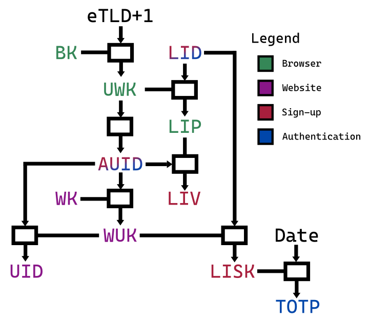

# WebIdentity: One-click passwordless signups & logins

I talked about [best-practices for password-based logins last time][MemorablePasswords],
and gave tools to help you follow them.

Password managers (and generators) must become prevalent.
Thankfully, it is becoming a reality: beyond services such as 1password or Dashlane,
browsers themselves now offer those features built-in.
It sprouted from the bookmark sync feature, became password sync,
and now has suggested random passwords.

But **passwords are inherently flawed** as a security user experience.
Honestly, they slow down both registration to a new service, and logins.
It annoys users, allows terrible security practices, and 
loses businesses billions yearly, both on users that give up,
and reputation from security issues.

There is a high cost to websites to implement and maintain security practices
around password storage.
By the way, this is the most significant example of “roll your own crypto”,
as each website defines its own authentication protocol.

There is also a cost for browsers: maintaining a list of passwords,
one for each website, makes for a fairly large total storage.
A significant, pernicious consequence is the emergence of siloes,
encouraging browser monopolies:
why would I switch browsers, when it is so hard to copy all those passwords over?

My hope for the future of authentication:

- Become so seamless that **both signing up and logging in is a single click**.
- We want that improved UX, not just with the same security level that we have now, but a much better one.
  - An attacker that got its hands on a fresh plaintext copy of the website’s database and secrets should be unable to authenticate on behalf of users.
  - Even if someone can decrypt traffic on-the-fly, from seeing the authentication information, they also can’t impersonate the user for more than 30 seconds afterwards.
  - Even with both a full-on breach of the website’s servers *and* on-the-fly traffic decryption, they cannot sign up nor log in as you.
- And, cherry on top, we want to do so in such a way that *exporting identities between browsers and devices is extremely easy*.

I called this new scheme **WebIdentity**.

## The place of WebAuthn

Your mind may be itching to yell: “WebAuthn!”
So, before digging into the gritty details of WebIdentity,
let’s talk about the awesomeness that is WebAuthn.

[WebAuthn][] is an authentication scheme that relies on public-key cryptography.

A phenomenal advantage of WebAuthn over WebIdentity is
in the ability to leverage a wide range of different security devices
(Yubico, TouchID, Windows Hello, and so many more).
In short, it is *absolutely amazing* at second-factor authentication (2FA),
which is completely outside the scope of WebIdentity and would complement it beautifully.

However, WebAuthn has severe disadvantages for use as main authentication,
which WebIdentity solves wonderfully.
Betting on WebAuthn as the main sign-up and log-in system
risks significantly delaying the wide adoption
of passwordless authentication on the Web:

- Websites do not implement it because:
  - on the backend, it requires them to implement a PKI, which is an endeavor.
    Multiple public keys can map to the same user, and management of the keys
    (and of the certificate validation upon sign-up, when necessary) needs proper handling.
  - on the front-end, it requires subtle cryptography to handle the challenge handshake,
    that needs to be implemented not just for the Web, but for iOS and Android apps.
    With WebIdentity, there is no front-end change at all.
- **Feature detection** is involved. Both the front-end and the backend must know
  that the user can do WebAuthn on that device, and ideally, the backend stores it
  on secure httpOnly cookies. It also must store the list of credential IDs:
  there could be multiple users on the same device.
  WebIdentity relies on the user management feature already built into the browser’s Sync.
- For websites, it requires a **database access** for each authentication.
  That contributes to a requirement to only use WebAuthn for login, not session authentication.
  WebIdentity does both in one fell swoop, and database interaction is only needed for sign-ups and logins.
- More damningly, the protocol requires a back-and-forth;
  in other words, it cannot be used directly for all HTTP requests.
  It needs a separate, **unspecified session key management scheme** such as JWT.
  With WebIdentity, the user authentication scheme is indistinguishable from
  the session authentication scheme.
- Most damningly, **exporting the public/private key pairs between browsers** was not part of the design process.
  In fact, synchronizing those keys (some of which can change) between browsers is a complex operation.
  It goes so far that the [official recommendation from browser makers][Apple] is to never have WebAuthn log-in
  be the only log-in mechanism, because private keys are tied to the device.
  Changing (or losing) devices require logging in through another means.
  Thus, it is only a faster log-in process (click login, select identity, accept request, enter biometrics or press Yubikey button)
  than passwords, but passwords remain the main log-in weak link that won’t die.
  Meanwhile, WebIdentity has a faster log-in still (there is literally just the click login step),
  and can fully replace passwords.
- To roll it out slowly, it started being **used only as 2FA**.
  It is now usually tied to things like Yubikey in the UX,
  and seems doomed to remain only used for 2FA,
  as a consequence of everything listed above.
- WebAuthn suffers from **crypto-agility**, similar to JWT where it caused security faults.
  In WebIdentity, algorithms are set for each version,
  and version changes are only performed when the previous algorithm is broken.
  Since there is really only one cryptographic algorithm, it is easy to keep track of.
- In the same vein, it is easy for a service operator to **misuse** WebAuthn,
  and end up losing major security protections. There are many subtle traps.
  For instance, they may generate challenges with a poor random source,
  or forget to validate some metadata field received.
- Where is the **NFC antenna** on this phone?
- Public-key cryptography is currently at risk from **quantum computing** advances,
  whereas WebIdentity relies on primitives that are essentially [quantum-resistant][].

All in all, WebAuthn is harder for website operators to put in place than passwords,
while WebIdentity is simpler.
(Although they would only do so once all major evergreen browsers implement it.)

The status quo: despite browsers’ efforts to add support not just for Yubikeys but also TouchID,
website owners are very shy in implementing support even just for 2FA,
in part because of the implementation complexity,
and the user experience is frustrating enough currently that few actually use it.
I do not know any independent commercial website
that uses WebAuthn as its primary log-in system, instead of passwords.

WebIdentity can quickly replace password authentication with a much simpler system,
both for users, website operators, and browsers;
while WebAuthn is likely to have a slow, 10-year adoption across websites.

However, WebIdentity does not replace WebAuthn!
WebAuthn is still extremely valuable as 2FA,
which should really be used on all sensitive actions on the website.

## Initialization

First, the browser stores a single random 256-bit secret for each user,
called the **Browser Key (BK)**,
synchronized across all devices through its Sync feature.
That key never leaves the browser.

Each website keeps around a random 256-bit secret key (**Website Key, WK**)
identified by a **key ID (KID)**,
typically a number incremented every time the key needs to change,
which should be rare, eg. yearly.
It must be generated by a CSPRNG, for instance from /dev/urandom.

## Sign-Up

When going on a page, the website advertizes that it supports WebIdentity
by delivering this header (even on 200 status results):

    WWW-Authenticate: Identity v1

Upon seeing it, the browser displays a “Log in” button *in its chrome*
(above the [line of death][], thus not in the webpage),
if the website uses TLS and HSTS.

When the user clicks it, from then on, for all HTTPS requests to that website,
the browser will authenticate the user to the website,
and display a “Log out” button instead of the “Log in” one.

But first, there is a tiny sign-up handshake.
First, the browser computes the **User’s Website Key (UWK)** as the MAC
of the effective Top-Level Domain [eTLD+1][PublicSuffix]:
it is unique for each entity that has control over a given cookie space,
and incidentally will also soon be [the only URL part shown][RegistrableDomain] (to fight phishing).
So the security UX will be consistent for identity and website trust here.
The UWK MAC is keyed with BK, the user’s Sync secret kept by the browser.
The UWK is a *secret that the browser has for each user and each website*.
It is never stored and never transmitted.

Then, the browser takes a MAC of the UWK, keyed with BK (the user’s Browser Key):
this becomes the **Authentication User ID (AUID)**
which will *identify the user in each HTTP request*.
Eavesdropper cannot find the UWK from it, which is good,
since it is only used for very rare, sensitive operations.

Finally, the browser picks a **Log-In Date (LID)** to send as an HTTP header,
and computes its MAC, keyed with the User’s Website Key (UWK).
The result is the **Log-In Proof token (LIP)**,
a piece of information kept secret by the browser,
which will be later revealed to the website when logging back in,
to strongly prove that the initiator is the initial user.

Aside: as you can imagine, there will be a whole tree of hashes,
each with a different purpose and name.
To help you follow along, here is a picture of the entire tree:

The browser reloads the page with the Date header set to the LID,
and the following new header
(all in one line, with spaces instead of newlines; the newlines are for readability):

    Authorization: Identity v1 SignUp
      auid="_r2AX32_B-nVFU5IUyc4_VdC1c5FCDSCRYkQd4DlPqg"
      liv="iOFqWGWM14o2jvETiuC583w4zci4sSBEXkzEvBE6khI"

- `Identity` indicates that it uses this authorization scheme.
- `v1` is the version of the scheme; it likely would change very rarely, typically when the hash function gets broken.
- `SignUp` is the action: here, we sign up as a new user.
- `_r2A…` is the Authentication User ID (AUID), which the website will rely on to identify the user.
- `iOFq…` is the **Log-In Verification token (LIV)**,
  a MAC of the Log-In Proof token (LIP) keyed with the AUID.
- The LID is sent in the Date header so that the website can store it.

The website cannot guess the LIP, nor can any eavesdropper,
which is good, since the LIP will be used to prove knowledge of BK
for rare, sensitive updates.

The website identifies the user from the AUID (indirectly),
but it cannot guess the user’s AUID for another website.
Besides, two websites cannot know that their respective AUIDs correspond to the same user
without seriously endangering the security of their own authentication.
That protects the user’s privacy across websites.

Upon receiving a SignUp request,
the website takes a MAC of the AUID, keyed with WK (the website’s secret key).
That is the **Website’s User Key (WUK)**, a secret kept by the website, unique to a user.
It is roughly the opposite of the User’s Website Key (UWK).
The user cannot know the website’s other users’ WUK,
since it would need both their BK and the WK to do so.

Then, the website computes the **User ID (UID)** as the MAC of the AUID
keyed with its Website’s User Key (WUK).
The UID will be stored in database, etc.
Intruders cannot find the AUID nor the WUK from read-only access to the database,
preventing them from crafting fake authenticated requests.

Then it does the following:

1. It verifies that the LID is within one minute of its known date. If not, the sign-up is denied.
2. It stores in database the UID, the LID, and the LIV, likely with a mapping to its internal user identifier.
   In our example, the UID is `XvP5sxmrh8UmpgYqJ9OmKs9HqhxcdS5-lUxlaEuhBc4`.

Then, the website prepares a response.

First, it constructs the **Log-In Shared Key (LISK)**
as the MAC of the Log-In Date (LID) keyed with the Website’s User Key (WUK).
That key will be *shared between the website and the browser* for one hour,
and will be used to compute a TOTP.

If the website sees that the user was already signed up,
it will accept it, but with slight differences in the response
that are discussed in the Log In section.
Otherwise, it returns a page with the following header:

    WWW-Authenticate: Identity v1 Key
      kid="2020"
      auid="_r2AX32_B-nVFU5IUyc4_VdC1c5FCDSCRYkQd4DlPqg"
      id="ZXNwYWRyaW5l"
      lisk="Cru8G_ulATqwIGzxU_MetC0WrcOWF51BLWXD6sPqa90"

- `Key` is the action instructing the browser to store the website’s key.
- `2020` is the KID, placed first to ease inspection.
- `_r2A…` is the AUID, identifying the user in all future requests.
- `ZXNw…` is the ID, the identifier that the website relies on internally to reference the user, encoded here in base64url.
  In our case, it is `espadrine`.
- `Cru8…` is the LISK, which will be used to prove that the user is who they claim to be for one hour.

The browser stores the version (v1), the KID, the LID, the ID and the LISK in its Sync feature.

## Authentication

On each HTTP request while logged in, the browser sends the AUID,
along with a MAC of the Date HTTP header keyed with the LISK:

    Authorization: Identity v1 Auth
      kid="2020"
      auid="_r2AX32_B-nVFU5IUyc4_VdC1c5FCDSCRYkQd4DlPqg"
      id="ZXNwYWRyaW5l"
      lid="Fri, 03 Jul 2020 10:11:22 GMT"
      totp="imCpzFyYB6SOrOjRhzdtVOUrrJGEyzy0M_DC1u-9PyY"

- `Auth` is the action to authenticate the request.
- `2020` is the KID in use.
- `_r2A…` is the AUID, as returned from the SignUp response.
- `ZXNw…` is the internal identifier that the website uses to reference the user, in base64url.
  It is sent to avoid having the website make a database call to map the AUID to it.
- The Log-In Date (LID) lets the website compute the LISK.
- `imCp…` is the **Time-based One-Time Password (TOTP)**:
  the MAC of the Date (`Fri, 03 Jul 2020 14:32:20 GMT`), keyed with the LISK.

When receiving an Auth request, the website must:

1. Verify that the Date sent is within one minute of the accurate date. The request is denied otherwise.
2. Verify that the Log-In Date (LID) is not more than one hour old.
   The request is denied otherwise: the browser always knows to make a LogIn request (seen below) instead.
   (Note that it does not matter if the LID does not match the stored LID.
   That way, multiple browsers can share the same BK and still authenticate in parallel.)
3. Compute the MAC of the request’s AUID, keyed with the WK. That is the WUK.
4. Compute the MAC of the LID, keyed with the WUK. That is the LISK.
5. Compute the MAC of the Date, keyed with the LISK. Verify that it matches the TOTP. The request is denied otherwise.
6. Compute the MAC of the request’s AUID, keyed with the WUK: that is the UID, which can be used for application purposes.

Note that this computation does not require database access, and is quite efficient in software.

The explanation of the main principle of operation is already finished.
Let’s look at a few events that may occur,
ranging in order from uncommon (monthly?) to extremely rare (every 20 years?).

### Log Out

When logged in, the browser’s Log In button changes to a Log out button.

When clicking the Log out button,
the browser deletes the protocol version, KID, AUID, ID and LISK in Sync;
and no longer sends Authorization headers.

The browser logs out and logs back in automatically every hour,
to ensure it does not use the same LISK for too long.
Because of the way log-outs and log-ins work,
this is entirely seamless and invisible to the user.

### Log In

When the browser tries to log in, in fact, it starts by simply doing the sign-up procedure.

The website detects that a sign-up already occured, and initiates the login procedure:

    WWW-Authenticate: Identity v1 LogIn
      lid="Fri, 03 Jul 2020 10:11:22 GMT"

You can find after the LogIn keyword, the Log-In Date (LID) that the website registered for this UID.

The browser computes the User’s Website Key (UWK, a MAC of the eTLD+1 keyed with BK),
and keys with it a MAC of that LID.
That gives it the Log-In Proof (LIP) that was created during sign-up.

Just as with a normal sign-up,
the browser picks a new **Log-In Date (LID)** to send as an HTTP header,
and computes its MAC, keyed with the User’s Website Key (UWK).
The result is a brand-new **Log-In Proof (LIP)**.
(In our example, the new LID is `Fri, 03 Jul 2020 15:27:43 GMT`.)

It then sends a LogIn request,
which is essentially identical to the SignUp request, but with the new LIV:

    Authorization: Identity v1 LogIn
      auid="_r2AX32_B-nVFU5IUyc4_VdC1c5FCDSCRYkQd4DlPqg"
      olip="ykZ9EInb8UhoPZAZD00_XL3asi1d9noVYnBW04EK33Y"
      liv="trpgs8wzEzbVBDimCbaG3p_pohqkB19GGXwncc4VWRM"

- `_r2A…` is the Authentication User ID (AUID).
- `ykZ9…` is the old Log-In Proof (LIP).
- `trpg…`, is a new **Log-In Verification token (LIV)**,
  a MAC of the Log-In Proof (LIP) keyed with the AUID.
- The LID is sent in the Date header, so that the website can store it.

The website constructs the WUK as the MAC of the AUID keyed with its WK,
and gets the UID as the MAC of the AUID keyed with the WUK.
Then it validates the following:

1. The LID must be within one minute of its known date.
2. The old LIV must be the one associated with this UID as stored in database.
3. Computing the MAC of the old LIP transmitted in the request, yields the old LIV stored in database.

If the validation fails, the LogIn request is denied.
Then, if both validated OK, it updates in database the sign-up Date and the new LIV.

You may notice that neither the website,
nor any eavesdropper with full read access to the website,
could guess the LIP until they see it in the Log In request.
Thus, they could not perform a Log In request;
and when they see it in the HTTPS payload, it is too late to take advantage of it,
as the LIV is updated with a new one for which they don’t have the LIP.

The rest goes exactly like a Sign Up:

    WWW-Authenticate: Identity v1 Key
      kid="2020"
      auid="_r2AX32_B-nVFU5IUyc4_VdC1c5FCDSCRYkQd4DlPqg"
      id="ZXNwYWRyaW5l"
      lisk="nAMMy6iuDlJ9JpCYeac_0DOq1OQv1HVP_1wsV36pQN8"

- `Key` is the action instructing the browser to store the website’s key.
- `2020` is the KID, placed first to ease inspection.
- `_r2A…` is the AUID, identifying the user in all future requests.
- `ZXNw…` is the website’s internal user reference in database.
- `nAMM…` is the Log-In Shared Key (LISK), which will be used to prove that the user is who they claim to be.

The browser stores the version (v1), the KID, the new LID and the LISK in its Sync feature.

### Website key update

If the website worries its key may be compromised, it will rekey.
However, it must keep all past keys, and accept all of them,
so that users can authenticate even years after the last request.

(The main point of rekeying is to migrate users to a key
that is not compromised, such that they don’t run the risk of being
impersonated if the website has futher severe security failures.)

Once rekeyed, when the website receives an Auth request with an old key,
it authenticates the request with the corresponding key and accepts the request,
but responds with a new Key action, similar to a sign-up:

    WWW-Authenticate: Identity v1 Key
      kid="2021"
      auid="_r2AX32_B-nVFU5IUyc4_VdC1c5FCDSCRYkQd4DlPqg"
      id="ZXNwYWRyaW5l"
      lisk="nAMMy6iuDlJ9JpCYeac_0DOq1OQv1HVP_1wsV36pQN8"

When receiving this, the browser updates its KID and LISK in its Sync storage for the website.
It then uses the new LISK on future authentications.

As long as the website only performs the rekeying after they regained full access
and ensured that their TLS connections were not (or no longer) compromised,
this sensitive transmission of a LISK should not be eavesdropped.
After rekeying, they can therefore safely communicate to all customers
the need to log out and log back in.

### Browser export

Browsers must provide a way to export the Browser Key to another browser.
It is recommended that the browser export format be encrypted with the user’s master password.

From just the BK, the new browser can perform the Log In procedure on all websites.

### Account takeover or Browser Sync breach

When a user’s BK is leaked, the website owner (if customer service detects an account takeover)
or browser (in the case of a breach of their Sync service)
will instruct the user to trigger the **Browser Key Reset procedure**.

The browser must have a button in its UI (for instance, in the Sync Preferences page) triggering the procedure:

First, it will create a new BK, but keep the old BK around.

Then, for each website for which the user has a LISK associated to the old BK,
the browser will make a ReSignUp request, very similar to a LogIn request:

    Authorization: Identity v1 ReSignUp v1
      oauid="_r2AX32_B-nVFU5IUyc4_VdC1c5FCDSCRYkQd4DlPqg"
      olip="ykZ9EInb8UhoPZAZD00_XL3asi1d9noVYnBW04EK33Y"
      auid="H_ja9SqB0Iz5HgBzUmtA-rdBGDugiYk9S_GTTtlC36E"
      liv="VQ4RFiw7C_GqQ4cQO67GdUXoUYxOvVjgq7tV30ZOSIQ"

- `ReSignUp` is a new action to instruct the website to reset the UIDs everywhere where it matters, and provide a new LISK.
- `v1` means that the protocol used for the old IDs and tokens is v1. This is useful for the “Hash function theoretically broken” section.
- `_r2A…` is the old Authentication User ID (AUID).
- `ykZ9…` is the old Log-In Proof (LIP).
- `H_ja…` is a new Authentication User ID (AUID).
- `VQ4R…`, is a new Log-In Verification token (LIV),
  a MAC of the new Log-In Proof (LIP) keyed with the new AUID.
- The new LID is sent in the Date header.

The website treats it just like a LogIn request, except it also updates the UID in database.

A Browser Sync breach would obviously be a major event.
In the old password world, it is equivalent to
having the worldwide Google Chrome passwords leaked. It would cause all Chrome users
to need to reset their passwords one by one on every website.

Thankfully, with WebIdentity, this can be automated by the browser seamlessly.

First, the browser will need to close the breach.
Then, for each user, it will automatically trigger the Browser Key Reset procedure remotely.

Obviously, just as with a Google Chrome password leak,
adversaries could take control of user accounts by doing a ReSignUp on their behalf.
WebIdentity is better in this respect: the browsers can automatically update information,
leaving a small window for attackers to take over accounts;
while a password leak may have users that take years to update a given password.

Just as with passwords, it is recommended that browsers implement Sync
in such a way that the user decypts Sync secrets on their machine
through the use of a master password.
As a result, the Sync servers would only contain encrypted data without the key.
Obviously, even a leak of the mere encrypted data should trigger a ReSignUp,
but at least the risk of user account takeover would be greatly reduced.

### Hash function theoretically broken

It took ten years from SHA-1 publication to full-round collisions.
While SHA-2 has already survived twenty,
it is plausible that it gets eventually broken theoretically.
That was the motivation for the SHA-3 process,
which yielded a primitive seemingly likely to take even more time
than SHA-2 to get broken, thanks to its sponge construction.

When SHA-2 gets theoretically broken,
we will release v2 of the protocol.
Browser vendors and website operators will need to implement it
before it gets practically broken
(which for SHA-1 took ten years).

Websites supporting v2 must also support v1 for at least ten years,
which ought to be enough time for browser vendors to implement v2.

When browsers only support v1, and see support for v2 from a website,
they must send v1 requests, and the website must follow the v1 protocol.

When browsers implement v2 and hold a v1 authentication AUID/LISK,
they must follow the Browser Key Reset procedure.

### Threat models

- Website attack:
  - From a third party:
    - **Replay attack**: If they replay the encrypted request of an authenticated user within the 30-second window, they may trigger the corresponding action (eg. a bank transfer) twice. We recommend that websites implement idempotency checks, as this could also happen from network glitches.
    - If they get **read access to the website** database, the UID gives no information that can be used to authenticate on behalf of the user.
    - If they also compromise WK, the **website key**, they still lack the AUID (which is not stored) to be able to do anything.
    - If they compromise the **website’s TLS encryption**, such as with the [CloudFlare memory leak][], they can read the encrypted payloads between the user and the website.
      - Reading the requests gives them a valid AUID/LID/TOTP set, but they only have a 30-second window (1 minute in rare worst-case clock drifts) to perform authenticated requests on behalf of the user, as they lack the LISK to be able to MAC new dates. They cannot issue a LogIn or ReSignUp request, lacking the LIP; and this remains true even if they additionally compromise the WK and database. Securitywise, this is a significant improvement compared to JWT, PASETO and similar session token approaches, which typically have anywhere from 5 minutes (for access tokens) to months of lifetime (for refresh tokens). An attacker reading a JWT refresh token in the encrypted payloads can typically use it to get unlimited access tokens for weeks if not ever. By contrast, with WebIdentity, the longest this attacker would be able to make authenticated queries is a minute, but usually half that (as most clients will not have much clock drift).
      - They can also read SignUp requests, although those will be rarer. The response includes the LISK, letting them fabricate valid TOTPs past 30 seconds. However, it will be invalidated through automatic logout after up to one hour. LISKs older than one hour will be useless to an attacker. On the other hand, if they can read the TLS traffic on-the-fly, they can view the new LISKs. As long as they maintain this ability, they can authenticate on behalf of the user. The flaw must be fixed by the website, and all LIDs invalidated, forcing a re-login.
    - If they compromise both the **website’s TLS encryption and its WK**:
      - For each AUID/LID/TOTP they see in the encrypted traffic, if the LID is still valid, they can derive the current LISK, and with it, perform authenticated requests for up to one hour (after which the automatic logout will prevent that).
      - Similarly, they can get the LISK from SignUps and LogIns. If they can read the traffic on-the-fly, they can see the new LISKs produced even after the one-hour logout. Again, the solution is to fix the flaw and invalidate the LIDs.
  - From **another website**: knowledge of that website’s AUID is insufficient to guess other websites’ AUID (that requires knowing the BK), let alone the LISK (which requires that website’s WK).
  - From the **user**: knowledge of the LISK is insufficient to guess WK, the Website Key, and therefore, to make authenticated requests on behalf of other users of the website. Additionally, even if they could, knowledge of other users’ AUID would be necessary, which requires knowing their BK.
  - From the **browser**: since it has access to the Sync secrets, it can perform authenticated requests and account takeover for all its registered users. However, it cannot do so for users of other browsers, if their BK is not explicitly shared.
- Browser attack:
  - **XSS**: Since WebIdentity is controlled by the browser and has no JS integration, JS code cannot access secrets or perform authentication. All the exchanges and headers related to WebIdentity must be hidden from the page transparently. All same-origin requests are authenticated or not depending on whether the user has clicked the Log In button, and depending on the [credentials mode][]. Cross-site requests comply with CORS. The Authorization and WWW-Authenticate headers already have the right protections in place.
  - Browsers should never store BK on the device. They can store the websites’ KID, AUID, ID and LISK. An attacker that gains access to the **device’s permanent storage** will be unable to obtain the BK, and therefore sign up on new websites. They can however make authenticated requests on behalf of the user to websites in which they are signed up. It is therefore necessary for browsers to encrypt the Sync database when caching it locally, which is already the case. They should not use an encryption key that is common to multiple users (also already the case IIUC).
  - The Operating System and the CPU, on the other hand, can obviously access the BK **in memory** and perform authenticated requests and account takeover on behalf of the user, but not of other users.
  - **BK loss**: the Browser Sync could experience complete loss of data, including the BK, maliciously or accidentally. The consequence would be the same as a password manager, today, losing the passwords (which indeed is the main thing it wishes to guarantee as a business), or a website using WebAuthn as only primary authentication and the user losing their device (Yubico etc.): users would no longer be able to log in. However, people that switched browsers or backed up their BK would be able to add it back in using the *Browser Export* procedure. Thanks to /u/josejimeniz2 for raising this.

### Cryptographic comments

The whole scheme is both extremely inexpensive and simple to implement both for websites and browsers,
especially compared to current techniques (which involve, for instance, the expensive Argon2 for passwords).
The payload weigh is marginal.

It also does not make use of public-key cryptography,
which protects it from the threat of quantum computing advances.
The main impact might be longer hashes, although even that is in question.

The protocol is versioned in such a way that there is no cryptographic algorithm agility,
in line with common practices such as [age][] and [PASETO][].

The MAC algorithm for v1 of the protocol is HMAC-SHA256.

(I would love to put BLAKE3 here, but some websites will object to a non-NIST-approved primitive.
And SHA3 (with no HMAC!) would also be nice, I would love to argue for its use;
but it is true that some websites may have legacy and dependency constraints;
and unlike WebAuthn, the goal of WebIdentity is to quickly get very widespread adoption
as the primary authentication mechanism on the Web.)

All [base64url][] inputs must be converted to a byte buffer prior to use.
The implementation should be constant-time.

The eTLD+1 must be in ASCII punycode form for use in WebIdentity (simplifying debugging).

## Vectors

The examples use:

- Website eTLD+1: `example.org`.
- BK: `GVr2rsMpdVKNMYkIohdCLhOeHSBIL8KBjoCvleDbsJsK` (generated with `head -c 32 </dev/urandom | base64 | tr +/ -_`).
- WK: `DCmk1xzu05QmT578_9QUSckIjCYRyr19W0bf0bMb46MK`.
- MACs generated with `echo -n "$input" | openssl sha256 -hmac "$key" | cut -f2 -d' ' | xxd -r -p | base64 | tr +/ -_ | tr -d =`.

## Comments and links

[Blog comments here](https://www.reddit.com/r/espadrine/comments/hlrx40/webidentity_oneclick_passwordless_signups_logins/).

[MemorablePasswords]: https://espadrine.github.io/blog/posts/memorable-passwords.html
[line of death]: https://textslashplain.com/2017/01/14/the-line-of-death/
[PublicSuffix]: https://publicsuffix.org/
[RegistrableDomain]: https://chromium.googlesource.com/chromium/src/+/master/docs/security/url_display_guidelines/url_display_guidelines.md#registrabledomain
[credentials mode]: https://fetch.spec.whatwg.org/#ref-for-concept-request-credentials-mode
[CloudFlare memory leak]: https://blog.cloudflare.com/incident-report-on-memory-leak-caused-by-cloudflare-parser-bug/
[age]: https://github.com/FiloSottile/age
[PASETO]: https://paragonie.com/files/talks/NoWayJoseCPV2018.pdf
[BLAKE3]: https://github.com/BLAKE3-team/BLAKE3-specs/blob/master/blake3.pdf
[base64url]: https://tools.ietf.org/html/rfc4648#section-5
[WebAuthn]: https://webauthn.guide/
[Apple]: https://developer.apple.com/videos/play/wwdc2020/10670/
[quantum-resistant]: https://en.wikipedia.org/wiki/SHA-3#Security_against_quantum_attacks

