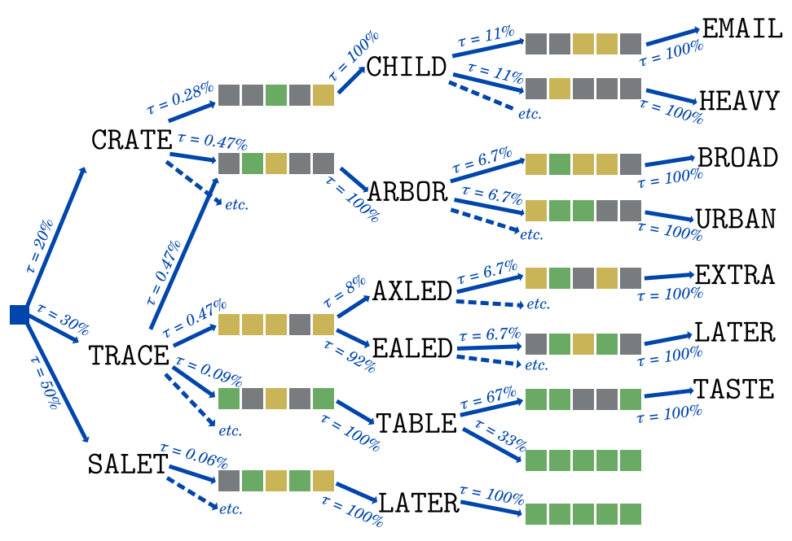
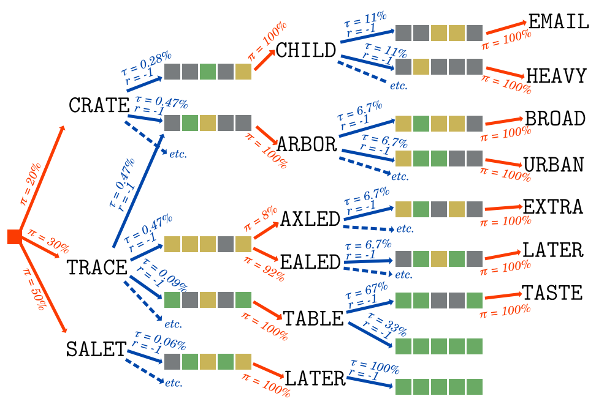
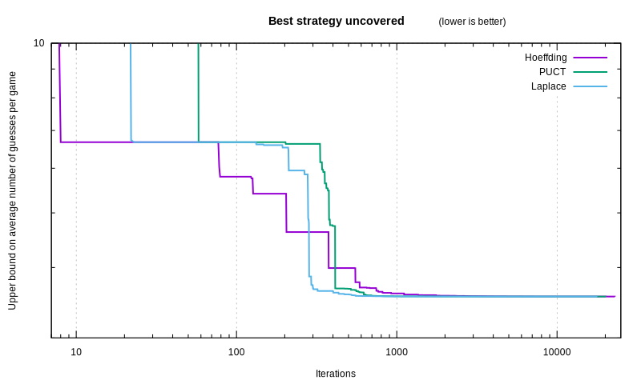
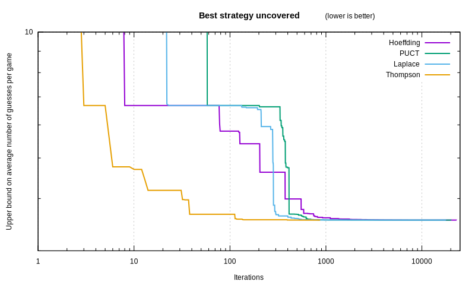
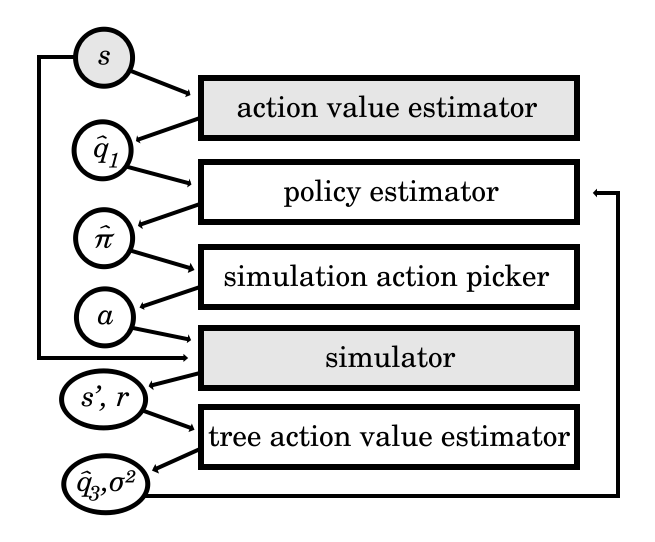
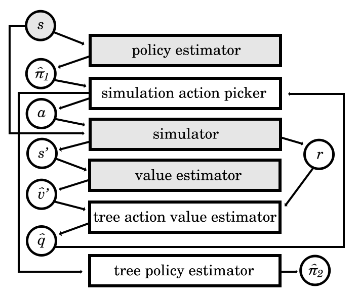

# Wordle Perfect Play with Generic Methods

Two years ago, the game of [Wordle][] was released.
As we strove to solve it optimally,
[we built fast estimators for the expected score in our previous article][art2].
Used as heuristics, it got us good scores, but not optimal play.

This time, using the estimators we devised,
let’s achieve perfection,
and let’s do that with algorithms generic enough to be applicable to most games.

## The Russian doll approach to optimization

Free will lets anyone do anything.
But if you have an objective in life,
some choices get you closer to it than others.
Can we study that difference mathematically?

We can certainly try!
Earth is a big anthill, and we all have agency in this world.
So let’s confront an agent to the randomness of its environment,
and study the decisions it makes.

One pretty darn good tool for it in our mathematical box
sprouts from Markov chains.
In Markov chains, an entity changes state in its environment
based on transition probabilities between states, like a leaf in the wind.



The leaf decides nothing. An agent, on the other hand, makes a decision,
which will lead it into a different state.
Maybe the agent is a bit irrational or uncertain,
and they may not take the same action in the same circumstances.
To study those decisions, we define them by the agent’s **Policy**, $`\pi(a|s)`:
it is the probability that the agent takes a given action in a given state.

Then, just like a Markov chain,
the environment randomly moves the agent to another state,
based on **State Transition** probabilities $`\tau(s'|s,a)`
which depend on the current state and the action of the agent.

By changing state, the environment may be more desirable to the agent.
We modelize that as a **Reward**, $`r(s,s')`:
a measurable value obtained by transitioning from one state to the next.
It may be meaningless, but the higher, the better.
In the case of Wordle, we want to minimize the number of guesses:
thus we give ourselves a negative, -1 reward every time we make a guess.

That is all there is to a [**Markov Decision Process**][RLBook]<sup><a href='#MDP'>\[MDP\]</a></sup>!
MDPs are more generic than Markov chains,
and more applicable to real-life situations like game optimization.



But how can we study agentic decisionmaking?
Surely some policies are better than others.
The optimal policy, perfect play, is written as $`\pi^*(a|s)`,
because it is the star of the show.
It is the policy that maximizes the State Value, which is…

The **State Value** under a policy, $`v_{\pi}(s)`,
is the expected rewards accumulated from the current state
onward to the infinite future if the agent acts according to the policy.

```latex
v_{\pi}(s) \stackrel{\text{def}}{=} \sum_{a} \pi(a|s) \sum_{s'} \tau(s'|s,a) \times (r(s,s') + v_{\pi}(s'))
```

The **Action Value** under a policy, $`q_{\pi}(s,a)`,
is a surprisingly useful metric,
defined as the expected rewards accumulated
from the current state onward to the infinite future,
if the agent makes a given action and then acts according to the policy.

```latex
q_{\pi}(s,a) \stackrel{\text{def}}{=} \sum_{s'} \tau(s'|s,a) \times (r(s,s') + v_{\pi}(s'))
```

Why is it useful? Well, thanks to a formidable theorem
called the **Bellman optimality equation**,
which recursively derives the action value of the optimal policy:

```latex
\forall s,a: q_{\pi^*}(s,a) = \sum_{s'} \tau(s'|s,a) \times (r(s,s') + \max_{a'}(q_{\pi^*}(s',a')))
```

You may be starting to connect the dots!
- To find the optimal policy, you simply need to define your policy
  as *picking the choice with a maximal optimal action value*.
- To find the optimal action value, you simply need to improve its estimation
  by *computing the Bellman optimality equation
  from the subactions taken by your policy*.

Suddenly, all you need to focus on is predicting your cumulative reward better.

You start with an initial prediction for the action value
of each action you may take. At worst, you can give them equal value.
You pick one action randomly using your policy, and simulate what happens after.
That simulation samples an action value.
Keep in mind that it is not the optimal action value:

1. The policy you used for the simulation is not optimal yet, and
2. The reward may have variance, because both the policy and the state
   transition are probabilistic.

Still, you have a new approximate action value,
which you can use to improve your estimation,
using the Bellman optimality equation.

Pretty soon, you end up with a tree of simulated futures.
Since we randomly picked actions to search through that tree,
we call this algorithm
[**Monte-Carlo Tree Search**][MCTS]<sup><a href='#MCTS'>\[MCTS\]</a></sup>.
With every new simulation, our predicted action values get more accurate,
and from that, we can execute the optimal policy.

```julia
function simulate!(state)
  action = sample_action(state)
  next_state, reward = sample_next_state(state, action)
  sampled_action_value = reward + next_state.best_action.value
  state.visits += 1
  action.visits += 1
  action.value = streamed_mean(action.value, sampled_action_value, action.visits)
  state.best_action = state.actions[argmax(action.value for action in state.action)]
end

function sample_next_state(state, action)
  next_state, reward = sample_transition(state, action)
  if next_state.visits == 0
    next_action = sample_action(next_state)
    next_action.value = estimate_action_value(next_state, next_action)
    next_state.best_action = next_action
  else
    simulate!(next_state)
  end
  return next_state, reward
end
```

Notice we use `estimate_action_value()`,
which is implemented by the [entropic estimator
we described in the previous article][art2].
That weaker estimator, hidden within the stronger MCTS estimator,
like a Russian doll of estimations, helps bootstrap its accuracy.
Fear not how few dolls there are, for we will cheerfully add more later.

As a quick aside, the `streamed_mean` is a neat algorithm from
[Welford][]<sup><a href='#WEL'>[WEL]</a></sup> for computing a mean one value at a time:

```julia
function streamed_mean(old_mean, new_value, new_count)
  return old_mean + (new_value - old_mean) / new_count
end
```

Another aside: in Wordle and many other games,
we can brute-force the state transition function,
since it simply is the set of $`3^5=243` possible constraints
associated with a guess (eg. ⬛🟨⬛⬛🟩 the second letter is misplaced,
the fifth is right, the others are wrong):

```julia
function simulate!(state)
  action = sample_action(state)
  sampled_action_value = 0.0
  for next_state, prob_trans, reward in enumerate_next_states(action)
    # This now looks exactly like the Bellman equation:
    sampled_action_value += (reward + next_state.best_action.value) * prob_trans
  end
  state.visits += 1
  action.visits += 1
  action.value = streamed_mean(action.value, sampled_action_value, action.visits)
  state.best_action = state.actions[argmax(action.value for action in state.action)]
end
```

But we haven’t yet explained how we select an action to simulate.
If our policy is to always take the action with maximal estimated value,
and the one with the highest initial estimation
is actually below its true action value,
then it will increase every time, thus it will always be the highest,
and so we will never test out any other action,
even though there may well be one that is much better!

Walking the tradeoff between
picking the action that is most likely to be the best,
and trying out other actions that might turn out to be even better,
is a classic problem called the **exploration-exploitation dilemma**.
The literature often focuses on a simplified setup,
the **multi-armed bandit**. The bandit is a casino slot machine:
you insert a coin, and pull one of its arms.
Each arm has a fixed, distinct probability of yielding a payout.
As a player, you wish to press the arm with the highest expected payout,
but you can only tell which one it is
through the frequency and amount of the payouts you observe.
You want to minimize the regret of pressing the wrong arm.

There are hacks aplenty to achieve a reasonably low regret!

The oldest trick in the book is to pick an action uniformly at random,
with a small probability $`\epsilon`,
and to otherwise pick the action with the highest estimated value.
It is called the [**epsilon-greedy**][EpsilonGreedy]<sup><a
href='#GREED'>\[GREED\]</a></sup> policy for obvious reasons.
For non-obvious reasons,
as long as you decay the value of $`\epsilon` with the right schedule,
it [keeps cumulative regret logarithmic][RegretBounds]<sup><a href='#REG'>\[REG\]</a></sup>
as more simulations are performed!
Knowing which schedule to use is a dark art, however;
in other words: “I just tried a few values and this one looked OK I guess.”

But epsilon-greedy can have quite a finicky behaviour,
especially when there are a huge number of arms,
which is the case with Wordle:
we can submit one of 14855 words as guesses.
That is a larger action space than in the game of Go,
[which is already a challenge at ~250 actions per move][AlphaGoPage]<sup><a
href='#AG'>\[AG\]</a></sup>.

How can we do better?
Here’s an insight: the problem stems from not knowing the exact action value.
We can use the uncertainty we have on it to calculate the action we pick.

The most popular trick simply computes a confidence interval,
and selects the action with the highest upper bound.
Just like the previous trick, its popular name is self-explanatory:
**Upper Confidence Bound (UCB)**.
However, how can you compute the confidence interval
on a random variable whose distribution you don’t even know?

You can derive a formula from [**Hoeffding's inequality**][Hoeffding]<sup><a href='#HOEFF'>\[HOEFF\]</a></sup>,
a fun theorem that gives an upper bound for a probability
related to the sample mean $`\hat{\mu} = \frac{\sum Q}{n}`
and the true mean $`\mu = \mathbb{E}[\frac{\sum Q}{n}]`
of $`n` independent random variables $`Q_i` such that $`L_i \le Q_i \le U_i`
(with $`0 \le i \lt n`):

```latex
\Pr\left(\hat{\mu} - \mu \ge \delta\right) \le e^{\frac{-2n^2\delta^2}{\sum(U_i-L_i)^2}}
```

If all $`Q_i` have the same bounds and a symmetric distribution,
we can derive from it this inequality:

```latex
p \stackrel{\text{def}}{=} \Pr\left(\mu \ge \hat{\mu}+\delta\right) \le e^{\frac{-2n\delta^2}{(U-L)^2}}
```

From that, you can compute a distribution-agnostic upper bound
based on an arbitrary confidence interval size (eg. $`p = 0.999`):

```latex
\delta = (U-L) \times \sqrt{\frac{-\log(p)}{2n}}
```

We can now plug this formula into an action selector:

```julia
function sample_action(state)
  return argmax(action_value_upper_bound_hoeffding, state.actions)
end

function action_value_upper_bound_hoeffding(action)
  # I just tried a few values and this one looked OK I guess.
  p_value = 0.999
  upper_action_value = 0
  lower_action_value = -6  # We lose the game after 6 failed guesses.
  factor = (upper_action_value - lower_action_value) * sqrt(-log(p_value)/2)
  return action.value + factor * (choice.visits+1)^-0.5
end
```

It may look OK at a glance, but sadly,
allocating all 14855 actions in each state will blow our RAM budget.
For now, when allocating a new state, we will only load in
the best 100 actions, based on our action value estimator.
You may justly object! Some action beyond that limit might be optimal.
But we are already swimming in heuristics anyway at this point.
However, I promise we will fix this oversight later.

Another famous action sampler appeared in [the AlphaGo paper][AlphaGo]<sup><a
href='#AG'>\[AG\]</a></sup>, dubbed **PUCT**
(Predictor-based Upper Confidence Bound for Trees).
It is also in the UCB family,
but it makes use of a policy estimator $`\hat{\pi}(a|s)`,
and of the number of simulations in other actions $`n_{s,a}`.
The upper bound it computes has the following formula:

```latex
\delta(s,a) = c_{puct} \hat{\pi}(a|s) \frac{\sqrt{\sum_b n_{s,b}}}{1+n_{s,a}}
```

```julia
function sample_action(state)
  sum_exp_value = 0.0
  for action in state.actions
    sum_exp_value += exp(action.value_estimate)
  end
  return argmax(action ->
    action_value_upper_bound_puct(state, action, sum_exp_value),
    state.actions)
end

function action_value_upper_bound_puct(state, action, sum_exp_value)
  # I just tried a few values and this one looked OK I guess.
  coeff = 1.0
  # We set the policy as the softmax of the initial action value estimate.
  policy = exp(action.value_estimate) / sum_exp_value
  return action.value + coeff * policy * sqrt(state.visits) / (1 + action.visits)
end
```

On the plus side,
it was good enough that it beat the best Go player in the world.
On the other hand, while there is [some recent analysis][PUCT]<sup><a
href='#PUCT'>\[PUCT\]</a></sup> linking the formula
to regularized policy optimization theory,
as best as we can tell, it was hand-tweaked haphazardly,
not the result of a mathematical derivation.
That implies that there may well be superior designs!

For the sake of comparing action samplers,
let’s throw in one of my own invention,
which I call the Laplace sampler, inspired by the rule of succession.
The idea is: how much would a new simulated action value
with a fixed offset affect the estimation?
We compute that crudely:

```julia
function sample_action(state)
  return argmax(action_value_upper_bound_laplace, state.actions)
end

function action_value_upper_bound_laplace(action)
  # I just tried a few values and this one looked OK I guess.
  delta = 0.1
  return (action.value * action.visits + (action.value + delta)) / (action.visits+1)
end
```

As it turns out, they can all can find the optimal policy,
barely, through sheer brute-force.
However, you may have noticed that, every time,
there was an arbitrary value we had to plug into the equation,
which had no justification, and which we had to guess barbarically.
Those are what we call **hyperparameters**:
values that our optimizer model needs,
so that it can find the parameters of the final model
(the optimal policy).

We have two hyperparameters right now:

- The **action sampler parameter** (the $`\epsilon` schedule for epsilon-greedy,
  the p-value for Hoeffding, the coefficient for PUCT,
  the value delta for Laplace…);
- The number of **top actions** we preselect to limit RAM use.

The values we picked might work for Wordle,
but does it truly work in the general case?
Does it always find the optimal policy?

I can tell you right now that there are some values
for which the algorithm never finds the optimal policy.
It is pretty obvious for the “top N actions” hyperparameters:
if those choices don’t include the optimal action,
we will never find it.
It is also true of the other hyperparameters.

The consequence is dire: we lose the guarantee that, with enough simulations,
the algorithm eventually yields the optimal strategy.
How can we tell, then, that we have likely found perfection,
apart from [comparing to compute-intensive non-generic exact solvers][Selby]<sup><a
href='#MIT'>\[MIT\]</a></sup>?

Can we have a more generic solution?

## Eulogy of the hyperparameters

By far the worst hyperparameter
is the exclusion of all actions except the 100 most promising.
But there really are too many actions
for the RAM to hold across all simulated states.

### Action cutoff

How do we humans handle gigantic action spaces?
Personally, I look at the most promising action,
and when I feel like I need to study other approaches,
I imagine another option and its outcome.

We can have a similar algorithm:

1. When we **select** an action to simulate,
   we only pick within a subset of actions $`\hat{\mathscr{A}}`
   kept in the state’s memory.
   It contains all actions that we have simulated in the past,
   and one action that is the most promising among the rest:
   the one with the highest estimated action value.
2. When we simulate a given state for the **first time**,
   we initialize the subset of actions with a single action:
   the most promising one of them all.
3. Every time we simulate the **least simulated action**,
   we also add a new action to our list:
   among all the actions we don’t yet have in our state,
   we pick the one that is most promising.
   That way, it can one day be explored.

That is not enough. As we ran the optimizer, a major issue reared its ugly head.
You see, the entropic estimator is biased.
It is too optimistic about its action value.

🔍 Let’s say it believes starting with “sater” *(that which satiates)*
will win in 2.9870 guesses on average.
That seems better than “raise”, which it believes takes 2.9925.  
🤏 So the action selector picks “sater”.  
📈After simulating it, though, it revises its estimation to 3.3142 guesses.  
🔍 Now, “raise” looks better (still at 2.9925).  
🤏 So the action selector simulates “raise”.  
📈 That in turn will revise it to 3.3498…  
🔍 which makes both look worse than “roate” *(to learn by repetition)* estimated at 2.9942.

You see where this is going:
no matter how good the action selector is,
it will always pick the action that has not been visited yet,
because that one always has a better estimated value
than those that have been visited
and whose estimation has thus been revised.
Therefore, despite our efforts to limit RAM use by only holding a subset,
we will quickly end up with that subset containing all actions.

What we wish we had was an estimator
that was independent of the number of simulations.

So let’s remove the bias from the one we have.
All it takes after all is to keep the history of estimations,
and to compute, for each possible action in our subset,
the difference between an estimation after a given number of simulations,
and the true action value
(approximated by the latest estimation for that action).

To sum up, we are building a tower of estimators
of increasing accuracy:

1. The **base predictor**, $`\hat{q}_1(s,a)`, uses the entropic estimator.
2. The **tree predictor** relies on the Bellman equation
   and the subactions explored after $`v` visits:
   ```latex
   \hat{q}_2(s,a,v) = \begin{cases}
   \hat{q}_1(s,a) &\text{if } v=0 \\
   \sum_{s'} \tau(s'|s,a) \times (r(s,s') + \max_{a'}(\hat{q}_3(s',a'))) &\text{otherwise}
   \end{cases}
   ```
3. The **debiased predictor** can be compared
   between actions of varying number of simulations $`v`:
   ```latex
   \begin{array}{ll}
   \hat{q}_3(s,a,v) &= \hat{q}_2(s,a,v) - \mathbb{E}[\hat{q}_2(s,a,v) - q_{\pi^*}(s,a)] \\
   &\approx \hat{q}_2(s,a,v) - \frac{\sum_{a'\in\hat{\mathscr{A}}_s} \hat{q}_2(s,a',v) - \hat{q}_2(s,a')}{|\hat{\mathscr{A}}_s|}
   \end{array}
   ```
   (We note $`\hat{q}_2(s,a)` and $`\hat{q}_3(s,a)` to be the estimation with
   the largest $`v`.)

That does the trick! We get convergence in a reasonable timeframe.



Laplace finds optimal play first, after 17735 iterations.
PUCT is next, with 20539 iterations.
Hoeffding comes in last, with 22954 iterations.

(Keep in mind, though, that this is very sensitive to their hyperparameters;
we spent as much time searching for a reasonable one on each,
so luck played a bit of a role.)

### Action picker

Now we point our sight to the other hyperparameter:
the one used in UCB and similar simulation samplers.

What would the ideal action picker look like?
There are a few properties we can determine:

- *If we know that one action is optimal for sure*, we must pick it.
- *If we know that one action is suboptimal for sure*, we must never pick it.  
  We must not waste simulation time on worse actions.
- *If we know that two actions are equally optimal*,
  we must pick them with equal probability.  
  (This one may be less intuitive, but picture a game of Rochambeau:
  if picking either rock, paper, or scissors,
  is not done with equal probability,
  then that is a vulnerability that the adversary can exploit.)

Inferring from those properties, a straightforward principle shapes up:
*If an action has X% chance of being optimal,
it ought to be selected with X% probability*.
That is the spirit behind [**Thompson sampling**][Thompson]
<sup><a href='#THOM'>\[THOM\]</a></sup>.

It would effectively be like sampling from our policy.
But how can we obtain our policy from the data we have so far?

Ultimately, the reason that we don’t simply select
the action whose estimated action value is highest,
is because we are uncertain on its exact value.
If we know exactly the probability distribution of all action values,
we can derive the probability that each action is optimal:
either through mathematical derivation
(if the distribution allows it),
or through stochastic averaging:
by sampling each action value from its known distribution many times,
and counting how many times each action comes out on top.

Stochastic averaging is particularly interesting for us:
not only does it forgo complex formulae,
it also works all the way to a single sample!
Sure, with a single sample, we won’t have a good estimation of the policy,
since all actions will have a 0% probabilty except one at 100%.
But the one that comes out on top can be explored right away:
it already follows the principle of Thompson sampling!
You can even parallelize the search, by picking the top K actions,
and exploring each of them in their own thread.

Still, we need to have a model for the probability distribution
of each action value. We can stay simple: a **Gaussian**,
with the estimated action value as its mean.

We now need its **variance**.
What does it represent? We are uncertain about the right value,
and the more simulations we have on an action, the more precise it becomes.
The earlier predictions that we kept in the action’s history
show just how wrong we were about the real value.
The error we made can be used to compute **the mean squared error**,
which is the variance we seek.

Since we get more precise with more simulations,
it makes sense to make the variance depend on the number of simulations.
For each number, we can compute the mean squared error across actions:

```latex
\begin{array}{ll}
\sigma^2(s,v) &= \mathbb{E}\left[(\hat{q}_3(s,\sdot,v) - q_{\pi^*}(s,\sdot))^2\right] \\
&\approx \frac{\sum_{a \in \mathscr{A}} (\hat{q}_3(s,a,v) - \hat{q}_3(s,a))^2}{|\hat{\mathscr{A}}_s|-1}
\end{array}
```

Is this system good though?

As it turns out, it blows other approaches out of the water,
quickly finding optimal play in a couple hours:



Thompson sampling finds optimal play after 870 iterations,
less than a tenth of the time!

## Reigning RAM in

Storing all of the history of our predictions in each action
gobbles a gargantuan amount of memory.
We couldn’t actually run the algorithm that produced the chart above,
until we implemented a few more tricks.

Mathematical wizardry saved our beef in the last article,
so perhaps it can help here too!

### Debiased predictor

We can aggregate the value bias information across actions within the state from which
those actions are taken.
There is a specific bias between the point where we have no simulation,
to the estimate after the first simulation;
there is a bias from the first simulation,
to the estimate after two simulations,
and so forth.
Let’s average each of those biases across actions:
then the bias we care about is the sum of per-simulation biases
across all remaining simulations!

```latex
\begin{array}{ll}
\hat{q}_3(s,a,v) &= \hat{q}_2(s,a,v) - \mathbb{E}\left[\hat{q}_2(s,\sdot,v) - q_{\pi^*}(s,\sdot)\right] \\
&= \hat{q}_2(s,a,v) - \mathbb{E}\left[\sum_{i=v}^{\infty} \hat{q}_2(s,\sdot,i) - \hat{q}_2(s,\sdot,i+1)\right] \\
&= \hat{q}_2(s,a,v) - \sum_{i=v}^{\infty} \mathbb{E}\left[\hat{q}_2(s,\sdot,i) - \hat{q}_2(s,\sdot,i+1)\right] \\
&\approx \hat{q}_2(s,a,v) - \sum_{i=v}^{v_{\text{max}}-1} \frac{\sum_{a'\in\hat{\mathscr{A}}_s} \hat{q}_2(s,a',i) - \hat{q}_2(s,a',i+1)}{|\hat{\mathscr{A}}_s|}
\end{array}
```

That way, all we need to store are the per-simulation biases,
updated after each new simulation
using the streamed mean we saw before<sup><a href='#WEL'>[WEL]</a></sup>:

```julia
function update_per_visit_bias!(state, n_simulations, old_action_value, new_action_value)
  action_count = number_of_actions_with_at_least(state, n_simulations)
  state.per_simulation_bias[n_simulations] = streamed_mean(state.per_simulation_bias[n_simulations], new_action_value - old_action_value, action_count)
end
```

### Variance

The mathematical derivation is a bit subtler here.

For the sake of succinctness, let’s define a function
for the difference between two debiased estimations:

```latex
\Delta_{\hat{q}_3}(s,a,v) \stackrel{\text{def}}{=} \hat{q}_3(s,a,v) - \hat{q}_3(s,a,v+1)
```

Since $`\hat{q}_3(s,a,v) \xrightarrow{v \rarr \infty} q_{\pi^*}(s,a)`, we have:

```latex
\hat{q}_3(s,a,v) - \sum_{i=v}^{\infty} \Delta_{\hat{q}_3}(s,a,i) = q_{\pi^*}(s,a)
```

```latex
\hat{q}_3(s,a,v) - q_{\pi^*}(s,a) = \sum_{i=v}^{\infty} \Delta_{\hat{q}_3}(s,a,i)
```

We can now derive:

```latex
\begin{array}{ll}
\sigma^2(s,v) &= \mathbb{E}\left[(\hat{q}_3(s,\sdot,v) - q_{\pi^*}(s,\sdot))^2\right] \\
&= \mathbb{E}\left[ (\sum_{i=v}^{\infty} \Delta_{\hat{q}_3}(s,\sdot,i))^2 \right] \\
\end{array}
```

Since $`\hat{q}_3` is debiased, $`\mathbb{E}\left[\Delta_{\hat{q}_3}(s,\sdot,v)\right] = 0`.
Let’s squint on the previous formula a bit and unearth a variance expression:

```latex
\sigma^2(s,v) = \text{var}\left( \sum_{i=v}^{\infty} \Delta_{\hat{q}_3}(s,\sdot,i) \right)
```

The changes in action value estimates are mostly uncorrelated
to the number of simulations, so we can proudly say:

```latex
\begin{array}{ll}
\sigma^2(s,v) &= \sum_{i=v}^{\infty} \text{var}\left(\Delta_{\hat{q}_3}(s,\sdot,i)\right) \\
&\approx \sum_{i=v}^{v_{\text{max}}-1} \frac{\sum_{a \in \mathscr{A}} \Delta_{\hat{q}_3}(s,a,i)^2}{|\hat{\mathscr{A}}|-1} \\
\end{array}
```

We are now free to only keep the variance of action value changes
after a simulation, in the state itself, without polluting each action.
It is easy to update the variance, by keeping the sum of squares in the state:
the update is then just adding in the square of the delta.
Whenever we want the variance,
we divide it by the number of actions that reached this number of simulations.

That in turn fully allows us to remove action value histories,
and the RAM thanks us for it!

[The algorithm’s code is open-source][Code].

## A new entry in a large tent

A major aspect of this optimizer is how generic it is.
All it needs is an action value predictor,
and it will converge to optimal play on its own.
Overall, the structure of this optimizer is like this:



It is far from the first generic MDP optimizer.
AlphaGo is a famous example, although I’d argue it is a bit more complex,
as it hinges on plugging in both a policy estimator and a value estimator
(whereas for us, we only plug in an action value estimator):



It uses PUCT as its simulation action picker,
which as we mentioned seems a bit flawed,
which [other groups within Deepmind][PUCT]<sup><a
href='#PUCT'>\[PUCT\]</a></sup>, and even [the original authors][GumbelMuZero]<sup><a
href='#GMZ'>\[GMZ\]</a></sup>, investigated in other papers.

The main issue with relying on a policy estimator is that
improving it from a single simulation of the future has no obvious formula.

Indeed, the policy learning algorithm used by AlphaGo
instead makes hundreds of simulations,
each of which updates an action value
which changes how soon the action will be simulated again.
That in turn changes the number of times the action has been visited
among all simulations, to which the refined policy value is proportional.
That is how [AlphaGo Zero’s][AlphaGoZero]<sup><a href='#AGZ'>\[AGZ\]</a></sup>
(and [AlphaZero’s][AlphaZero]<sup><a href='#AZ'>\[AZ\]</a></sup>,
and [MuZero’s][MuZero]<sup><a href='#MZ'>\[MZ\]</a></sup>)
tree policy estimator (in the diagram above) works:

```latex
\hat{\pi}(a|s) = \frac{N(s,a)^{\frac{1}{\tau}}}{\sum_{a' \in \mathscr{A}} N(s,a')^{\frac{1}{\tau}}}
```

If instead of a policy estimator,
the building block we use is an action value estimator,
then the formula for refining its value is straightforward
and works even with a single simulation.
Additionally, it allows the type of elegant Thompson sampling we described,
which directly produces a more optimal policy estimation.

Using a policy network stems from a belief that
learning the comparative value of actions is easier than learning their impact.
I wonder, though, given how good our neural-network-based predictors get,
if we can accomplish better results with direct action value estimation.

Moreover, policy estimators are built to compute probabilities
over the entire set of a fixed number of possible actions.
Soon enough, machine learning systems
will operate on virtually unbounded sets of choices.
Isn’t your world fairly open-ended, after all?
When you go fetch groceries, do you ponder the policy value of driving
to each building in the world, no matter how remote?

In order to ground them to true experiences and break the hallucination curse,
I believe the next breed of fine-tuning will need to simulate random futures
within their latent world model,
and optimize for the action values they predict,
without exhaustively estimating policies.

## References:

- [<span id=MDP>\[MDP\]</span>: Bellman, R. E. (1957b). A Markov decision process. Journal of Mathematics and Mechanics, 6(5):679–684][MDP]
- [<span id=MCTS>\[MCTS\]</span>: Rémi Coulom. Efficient Selectivity and Backup Operators in Monte-Carlo Tree Search. 5th International Conference on Computer and Games, May 2006, Turin, Italy. inria-00116992][MCTS]
- [<span id=WEL>[WEL]</span>: Welford, B. P. (1962). "Note on a method for calculating corrected sums of squares and products". Technometrics. 4 (3): 419–420. doi:10.2307/1266577][Welford]
- [<span id=GREED>\[GREED\]</span>: Watkins, C.J.C.H., 1989. “Learning from Delayed Rewards”; cf. chapter 7, page 94.][EpsilonGreedy]
- [<span id=REG>\[REG\]</span>: Auer, P., Cesa-Bianchi, N. and Fischer, P., 2002. “Finite-time analysis of the multiarmed bandit problem”. Machine learning, 47, pp.235-256; cf. Theorem 3.][RegretBounds]
- [<span id=AG>\[AG\]</span>: Silver, D., Huang, A., Maddison, C.J., Guez, A., Sifre, L., Van Den Driessche, G., Schrittwieser, J., Antonoglou, I., Panneershelvam, V., Lanctot, M. and Dieleman, S., 2016. “Mastering the game of Go with deep neural networks and tree search”. Nature, 529(7587), pp.484-489.][AlphaGo]
- [<span id=AGZ>\[AGZ\]</span>: Silver, D., Schrittwieser, J., Simonyan, K., Antonoglou, I., Huang, A., Guez, A., Hubert, T., Baker, L., Lai, M., Bolton, A. and Chen, Y., 2017. Mastering the game of go without human knowledge. nature, 550(7676), pp.354-359.][AlphaGoZero]
- [<span id=AZ>\[AZ\]</span>: Silver, D., Hubert, T., Schrittwieser, J., Antonoglou, I., Lai, M., Guez, A., Lanctot, M., Sifre, L., Kumaran, D., Graepel, T. and Lillicrap, T., 2017. Mastering chess and shogi by self-play with a general reinforcement learning algorithm. arXiv preprint arXiv:1712.01815.][AlphaZero]
- [<span id=MZ>\[MZ\]</span>: Schrittwieser, J., Antonoglou, I., Hubert, T., Simonyan, K., Sifre, L., Schmitt, S., Guez, A., Lockhart, E., Hassabis, D., Graepel, T. and Lillicrap, T., 2020. Mastering atari, go, chess and shogi by planning with a learned model. Nature, 588(7839), pp.604-609.][MuZero]
- [<span id=HOEFF>\[HOEFF\]</span>: Hoeffding, Wassily (1963). “Probability inequalities for sums of bounded random variables”. Journal of the American Statistical Association. 58 (301): 13–30; cf. Theorem 2. doi:10.1080/01621459.1963.10500830][Hoeffding]
- [<span id=PUCT>\[PUCT\]</span>: Grill, J.B., Altché, F., Tang, Y., Hubert, T., Valko, M., Antonoglou, I. and Munos, R., 2020, November. “Monte-Carlo tree search as regularized policy optimization”. In International Conference on Machine Learning (pp. 3769-3778). PMLR.][PUCT]
- [<span id=MIT>\[MIT\]</span>: Bertsimas, D. and Paskov, A., 2022. An exact and interpretable solution to wordle. Preprint, submitted September, 20.][MITWordle]
- [<span id=THOM>\[THOM\]</span>: Thompson, W.R., 1933. On the likelihood that one unknown probability exceeds another in view of the evidence of two samples. Biometrika, 25(3-4), pp.285-294.][Thompson]
- [<span id=GMZ>\[GMZ\]</span>: Danihelka, I., Guez, A., Schrittwieser, J. and Silver, D., 2021, October. Policy improvement by planning with Gumbel. In International Conference on Learning Representations.][GumbelMuZero]

[Wordle]: https://www.nytimes.com/games/wordle/index.html
[art2]: https://espadrine.github.io/blog/posts/faster-wordle-estimators.html
[RLBook]: http://incompleteideas.net/book/RLbook2020.pdf
[MDP]: https://apps.dtic.mil/sti/pdfs/AD0606367.pdf
[MCTS]: https://inria.hal.science/inria-00116992/document
[Welford]: https://www.johndcook.com/blog/standard_deviation/
[EpsilonGreedy]: https://www.researchgate.net/profile/Christopher-Watkins-4/publication/33784417_Learning_From_Delayed_Rewards/links/53fe12e10cf21edafd142e03/Learning-From-Delayed-Rewards.pdf
[RegretBounds]: https://cesa-bianchi.di.unimi.it/Pubblicazioni/ml-02.pdf
[AlphaGoPage]: https://deepmind.google/technologies/alphago/
[AlphaGo]: https://deepmind-media.storage.googleapis.com/alphago/AlphaGoNaturePaper.pdf
[AlphaGoZero]: https://www.nature.com/articles/nature24270.epdf?author_access_token=VJXbVjaSHxFoctQQ4p2k4tRgN0jAjWel9jnR3ZoTv0PVW4gB86EEpGqTRDtpIz-2rmo8-KG06gqVobU5NSCFeHILHcVFUeMsbvwS-lxjqQGg98faovwjxeTUgZAUMnRQ
[AlphaZero]: https://arxiv.org/pdf/1712.01815.pdf
[MuZero]: https://arxiv.org/pdf/1911.08265.pdf
[Hoeffding]: https://repository.lib.ncsu.edu/server/api/core/bitstreams/d0e6ed15-3e1c-432f-8419-e55ffb6f3171/content
[PUCT]: https://arxiv.org/pdf/2007.12509.pdf
[Selby]: https://sonorouschocolate.com/notes/index.php/The_best_strategies_for_Wordle,_part_3_(July_2023)
[MITWordle]: https://auction-upload-files.s3.amazonaws.com/Wordle_Paper_Final.pdf
[Thompson]: https://academic.oup.com/biomet/article-abstract/25/3-4/285/200862
[GumbelMuZero]: https://openreview.net/pdf?id=bERaNdoegnO
[Code]: https://github.com/espadrine/optimal-wordle/blob/a132c028eeba64ab0311be69b6f73029638cd712/play-optimally.jl

<script type="application/ld+json">
{ "@context": "http://schema.org",
  "@type": "BlogPosting",
  "datePublished": "2024-03-07T18:07:23Z",
  "keywords": "ml, julia, optimization" }
</script>
